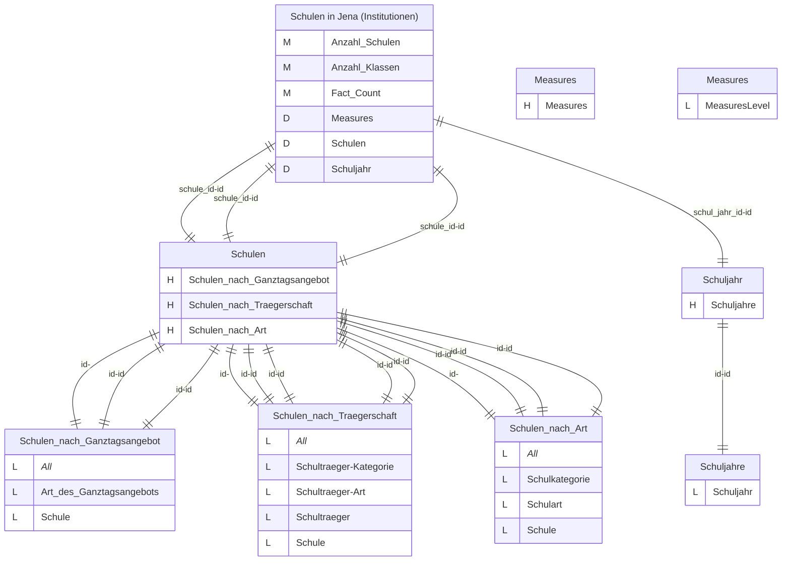
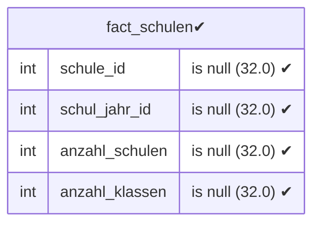
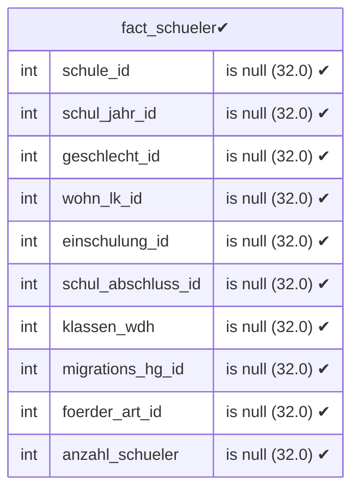
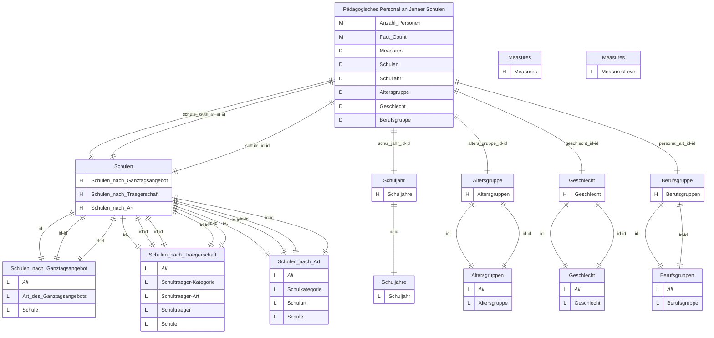
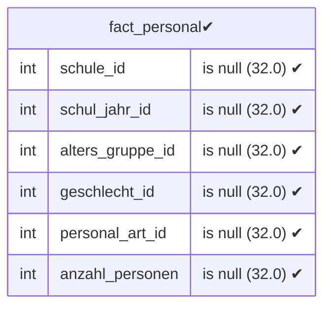
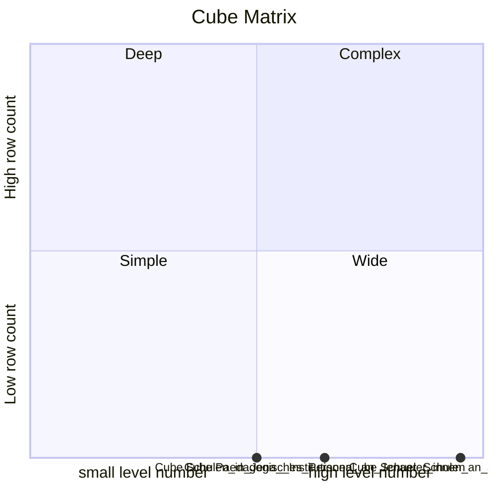

```mermaid
---
title: Diagram;
---
erDiagram
"schule✔"{
Integer id "is null ✔"
Varchar schul_name "is null ✔"
Integer schul_nummer "is null ✔"
Integer ganztags_art_id "is null ✔"
Integer traeger_id "is null ✔"
Integer schul_art_id "is null ✔"
}
"ganztags_art✔"{
Integer id "is null ✔"
Varchar schul_umfang "is null ✔"
}
"traeger✔"{
Integer id "is null ✔"
Varchar traeger_name "is null ✔"
Integer traeger_art_id "is null ✔"
}
"traeger_art✔"{
Integer id "is null ✔"
Varchar traeger_art "is null ✔"
Varchar traeger_kat_id "is null ✔"
}
"traeger_kategorie✔"{
Integer id "is null ✔"
Varchar traeger_kategorie "is null ✔"
}
"schul_art✔"{
Integer id "is null ✔"
Integer schul_kategorie_id "is null ✔"
}
"schul_jahr✔"{
Integer id "is null ✔"
Varchar schul_jahr "is null ✔"
Integer order "is null ✔"
}
"alters_gruppe✔"{
Integer id "is null ✔"
Integer altersgruppe "is null ✔"
}
"geschlecht✔"{
Integer id "is null ✔"
Integer bezeichnung "is null ✔"
}
"einschulung✔"{
Integer id "is null ✔"
Varchar einschulung "is null ✔"
}
"klassen_wiederholung✔"{
Integer id "is null ✔"
Integer klassenwiederholung "is null ✔"
}
"schul_abschluss✔"{
Integer id "is null ✔"
Varchar schulabschluss "is null ✔"
}
"migrations_hintergrund✔"{
Integer id "is null ✔"
Varchar migrations_hintergrund "is null ✔"
}
"wohnort_landkreis✔"{
Integer id "is null ✔"
Varchar bezeichnung "is null ✔"
Integer bundesland_id "is null ✔"
}
"schul_art✔"{
Integer id "is null ✔"
Varchar schulart_name "is null ✔"
}
"schul_kategorie✔"{
Integer id "is null ✔"
Varchar schul_kategorie_name "is null ✔"
}
"foerderung_art✔"{
Integer id "is null ✔"
Varchar foerderung_art "is null ✔"
Integer sp_foerderbedarf_id "is null ✔"
}
"personal_art✔"{
Integer id "is null ✔"
Varchar bezeichnung "is null ✔"
}
"bundesland✔"{
Integer id "is null ✔"
Varchar bezeichnung "is null ✔"
}
"sonderpaed_foerderbedarf✔"{
Integer id "is null ✔"
Varchar sonderpaed_bedarf "is null ✔"
}
"fact_schulen✔"{
Integer schule_id "is null ✔"
Integer schul_jahr_id "is null ✔"
Integer anzahl_schulen "is null ✔"
Integer anzahl_klassen "is null ✔"
}
"fact_personal✔"{
Integer schule_id "is null ✔"
Integer schul_jahr_id "is null ✔"
Integer alters_gruppe_id "is null ✔"
Integer geschlecht_id "is null ✔"
Integer personal_art_id "is null ✔"
Integer anzahl_personen "is null ✔"
}
"fact_schueler✔"{
Integer schule_id "is null ✔"
Integer schul_jahr_id "is null ✔"
Integer geschlecht_id "is null ✔"
Integer wohn_lk_id "is null ✔"
Integer einschulung_id "is null ✔"
Integer schul_abschluss_id "is null ✔"
Integer klassen_wdh "is null ✔"
Integer migrations_hg_id "is null ✔"
Integer foerder_art_id "is null ✔"
Integer anzahl_schueler "is null ✔"
}

"fact_schulen✔" ||--o{ "schule✔" : "schule_id-id"
"schule✔" ||--o{ "ganztags_art✔" : "ganztags_art_id-id"
"fact_schulen✔" ||--o{ "schule✔" : "schule_id-id"
"schule✔" ||--o{ "traeger✔" : "traeger_id-id"
"traeger✔" ||--o{ "traeger_art✔" : "traeger_art_id-id"
"traeger_art✔" ||--o{ "traeger_kategorie✔" : "traeger_kat_id-id"
"fact_schulen✔" ||--o{ "schule✔" : "schule_id-id"
"schule✔" ||--o{ "schul_art✔" : "schul_art_id-id"
"schul_art✔" ||--o{ "schul_kategorie✔" : "schul_kategorie_id-id"
"fact_schulen✔" ||--o{ "schul_jahr✔" : "schul_jahr_id-id"
"fact_personal✔" ||--o{ "schule✔" : "schule_id-id"
"schule✔" ||--o{ "ganztags_art✔" : "ganztags_art_id-id"
"fact_personal✔" ||--o{ "schule✔" : "schule_id-id"
"schule✔" ||--o{ "traeger✔" : "traeger_id-id"
"traeger✔" ||--o{ "traeger_art✔" : "traeger_art_id-id"
"traeger_art✔" ||--o{ "traeger_kategorie✔" : "traeger_kat_id-id"
"fact_personal✔" ||--o{ "schule✔" : "schule_id-id"
"schule✔" ||--o{ "schul_art✔" : "schul_art_id-id"
"schul_art✔" ||--o{ "schul_kategorie✔" : "schul_kategorie_id-id"
"fact_personal✔" ||--o{ "schul_jahr✔" : "schul_jahr_id-id"
"fact_personal✔" ||--o{ "alters_gruppe✔" : "alters_gruppe_id-id"
"fact_personal✔" ||--o{ "geschlecht✔" : "geschlecht_id-id"
"fact_personal✔" ||--o{ "personal_art✔" : "personal_art_id-id"
"fact_schueler✔" ||--o{ "schule✔" : "schule_id-id"
"schule✔" ||--o{ "ganztags_art✔" : "ganztags_art_id-id"
"fact_schueler✔" ||--o{ "schule✔" : "schule_id-id"
"schule✔" ||--o{ "traeger✔" : "traeger_id-id"
"traeger✔" ||--o{ "traeger_art✔" : "traeger_art_id-id"
"traeger_art✔" ||--o{ "traeger_kategorie✔" : "traeger_kat_id-id"
"fact_schueler✔" ||--o{ "schule✔" : "schule_id-id"
"schule✔" ||--o{ "schul_art✔" : "schul_art_id-id"
"schul_art✔" ||--o{ "schul_kategorie✔" : "schul_kategorie_id-id"
"fact_schueler✔" ||--o{ "schul_jahr✔" : "schul_jahr_id-id"
"fact_schueler✔" ||--o{ "geschlecht✔" : "geschlecht_id-id"
"fact_schueler✔" ||--o{ "wohnort_landkreis✔" : "wohn_lk_id-id"
"wohnort_landkreis✔" ||--o{ "bundesland✔" : "bundesland_id-id"
"fact_schueler✔" ||--o{ "einschulung✔" : "einschulung_id-id"
"fact_schueler✔" ||--o{ "schul_abschluss✔" : "schul_abschluss_id-id"
"fact_schueler✔" ||--o{ "klassen_wiederholung✔" : "klassen_wdh-id"
"fact_schueler✔" ||--o{ "migrations_hintergrund✔" : "migrations_hg_id-id"
"fact_schueler✔" ||--o{ "foerderung_art✔" : "foerder_art_id-id"
"foerderung_art✔" ||--o{ "sonderpaed_foerderbedarf✔" : "sp_foerderbedarf_id-id"
```

# Documentation
### CatalogName : Schulwesen
### Schema Schulwesen : 
---
### Cubes :

    Schulen in Jena (Institutionen), Schüler:innen an Jenaer Schulen, Pädagogisches Personal an Jenaer Schulen

### Cube "Schulen in Jena (Institutionen)" diagram:

---


---
### Database :
---

---
" Aggregation section:

---

---
### Cube "Schüler:innen an Jenaer Schulen" diagram:

---

```mermaid
%%{init: {
"theme": "default",
"themeCSS": [
    ".er.entityBox {stroke: black;}",
    ".er.attributeBoxEven {stroke: black;}",
    ".er.attributeBoxOdd {stroke: black;}",
    "[id^=entity-c] .er.entityBox { fill: lightgreen;} ",
    "[id^=entity-d] .er.entityBox { fill: powderblue;} ",
    "[id^=entity-h] .er.entityBox { fill: pink;} "
]
}}%%
erDiagram
c1["Schüler:innen an Jenaer Schulen"]{
M Anzahl_Schueler_innen ""
M Fact_Count ""
D Measures ""
D Schulen ""
D Schuljahr ""
D Geschlecht ""
D Wohnlandkreis ""
D Einschulung ""
D Schulabschluss ""
D Klassenwiederholung ""
D Migrationshintergrund ""
D Sonderpädagogische Förderung ""
}
d10["Measures"] {
H Measures ""
}
h100["Measures"] {
L MeasuresLevel ""
}
d11["Schulen"] {
H Schulen_nach_Ganztagsangebot ""
H Schulen_nach_Traegerschaft ""
H Schulen_nach_Art ""
}
h110["Schulen_nach_Ganztagsangebot"] {
L _All_ ""
L Art_des_Ganztagsangebots ""
L Schule ""
}
h111["Schulen_nach_Traegerschaft"] {
L _All_ ""
L Schultraeger-Kategorie ""
L Schultraeger-Art ""
L Schultraeger ""
L Schule ""
}
h112["Schulen_nach_Art"] {
L _All_ ""
L Schulkategorie ""
L Schulart ""
L Schule ""
}
d12["Schuljahr"] {
H Schuljahre ""
}
h120["Schuljahre"] {
L Schuljahr ""
}
d13["Geschlecht"] {
H Geschlecht ""
}
h130["Geschlecht"] {
L _All_ ""
L Geschlecht ""
}
d14["Wohnlandkreis"] {
H Wohnlandkreis ""
}
h140["Wohnlandkreis"] {
L _All_ ""
L Bundesland ""
L Wohnlandkreis ""
}
d15["Einschulung"] {
H Einschulung ""
}
h150["Einschulung"] {
L _All_ ""
L Einschulung ""
}
d16["Schulabschluss"] {
H Schulabschluesse ""
}
h160["Schulabschluesse"] {
L _All_ ""
L Schulabschluesse ""
}
d17["Klassenwiederholung"] {
H Klassenwiederholung ""
}
h170["Klassenwiederholung"] {
L _All_ ""
L Klassenwiederholung ""
}
d18["Migrationshintergrund"] {
H Migrationshintergrund ""
}
h180["Migrationshintergrund"] {
L _All_ ""
L Migrationshintergrund ""
}
d19["Sonderpädagogische Förderung"] {
H Sonderpaedagogische_Foerderung ""
}
h190["Sonderpaedagogische_Foerderung"] {
L _All_ ""
L Foerderbedarf ""
L Art_der_Foerderung ""
}
"c1" ||--|| "d11" : "schule_id-id"
"d11" ||--|| "h110" : "id-"
"d11" ||--|| "h110" : "id-id"
"d11" ||--|| "h110" : "id-id"
"c1" ||--|| "d11" : "schule_id-id"
"d11" ||--|| "h111" : "id-"
"d11" ||--|| "h111" : "id-id"
"d11" ||--|| "h111" : "id-id"
"d11" ||--|| "h111" : "id-id"
"d11" ||--|| "h111" : "id-id"
"c1" ||--|| "d11" : "schule_id-id"
"d11" ||--|| "h112" : "id-"
"d11" ||--|| "h112" : "id-id"
"d11" ||--|| "h112" : "id-id"
"d11" ||--|| "h112" : "id-id"
"c1" ||--|| "d12" : "schul_jahr_id-id"
"d12" ||--|| "h120" : "id-id"
"c1" ||--|| "d13" : "geschlecht_id-id"
"d13" ||--|| "h130" : "id-"
"d13" ||--|| "h130" : "id-id"
"c1" ||--|| "d14" : "wohn_lk_id-id"
"d14" ||--|| "h140" : "id-"
"d14" ||--|| "h140" : "id-id"
"d14" ||--|| "h140" : "id-id"
"c1" ||--|| "d15" : "einschulung_id-id"
"d15" ||--|| "h150" : "id-"
"d15" ||--|| "h150" : "id-id"
"c1" ||--|| "d16" : "schul_abschluss_id-id"
"d16" ||--|| "h160" : "id-"
"d16" ||--|| "h160" : "id-id"
"c1" ||--|| "d17" : "klassen_wdh-id"
"d17" ||--|| "h170" : "id-"
"d17" ||--|| "h170" : "id-id"
"c1" ||--|| "d18" : "migrations_hg_id-id"
"d18" ||--|| "h180" : "id-"
"d18" ||--|| "h180" : "id-id"
"c1" ||--|| "d19" : "foerder_art_id-id"
"d19" ||--|| "h190" : "id-"
"d19" ||--|| "h190" : "id-id"
"d19" ||--|| "h190" : "id-id"
```
---
### Database :
---

---
" Aggregation section:

---

---
### Cube "Pädagogisches Personal an Jenaer Schulen" diagram:

---


---
### Database :
---

---
" Aggregation section:

---

---
### Cube Matrix for Schulwesen:

---
### Database :
---

---
## Validation result for catalog Schulwesen
## <span style='color: blue;'>WARNING</span> : 
|Type|   |
|----|---|
|DATABASE|Table: Schema must be set|
