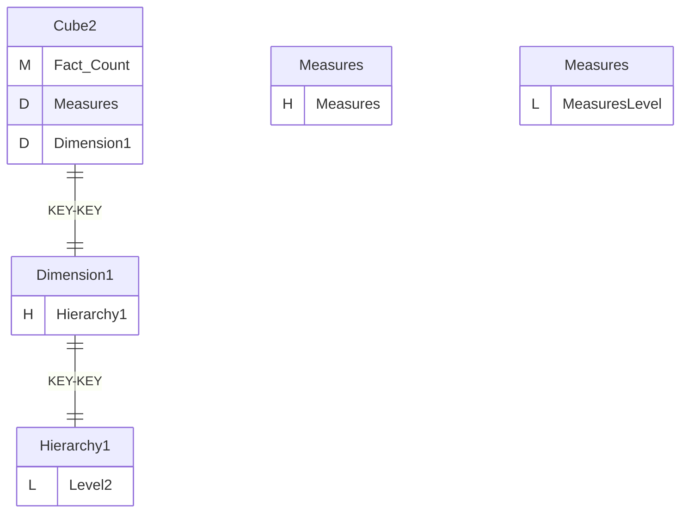
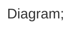
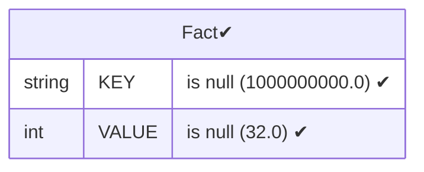
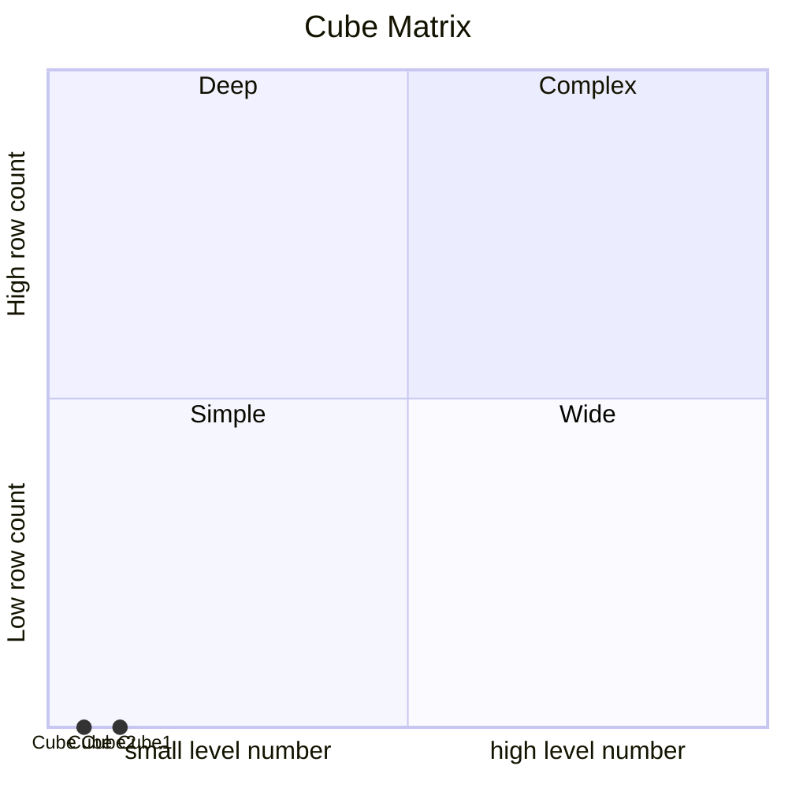

# Documentation
### CatalogName : Cube_with_role_access_all_none_custom
### Schema Cube_with_role_access_all_none_custom : 
---
### Cubes :

    Cube2

### Roles :
##### Role: "role12"

### Cube "Cube2" diagram:

---

---
### Database :
---

---
" Aggregation section:

---

---
### Cube Matrix for Cube_with_role_access_all_none_custom:

---
### Database :
---

---
## Validation result for catalog Cube_with_role_access_all_none_custom
## ERROR : 
|Type|   |
|----|---|
|SCHEMA|MemberGrant member use Dimension1 dimension which absent in cube with name Cube1|
## WARNING : 
|Type|   |
|----|---|
|DATABASE|Table: Schema must be set|
