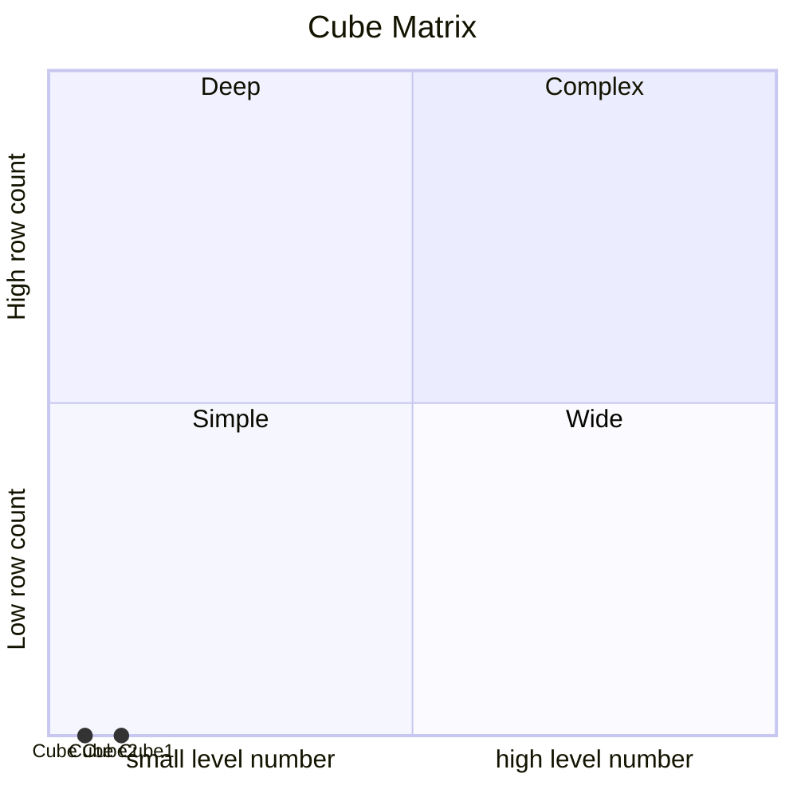
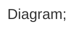

# Documentation
### CatalogName : Cube_with_access_all_dimension
### Schema Cube_with_access_all_dimension : 
---
### Cubes :

    

### Roles :
##### Role: "role1"

### Cube Matrix for Cube_with_access_all_dimension:

---
### Database :
---

---
## Validation result for catalog Cube_with_access_all_dimension
## WARNING : 
|Type|   |
|----|---|
|DATABASE|Table: Schema must be set|
