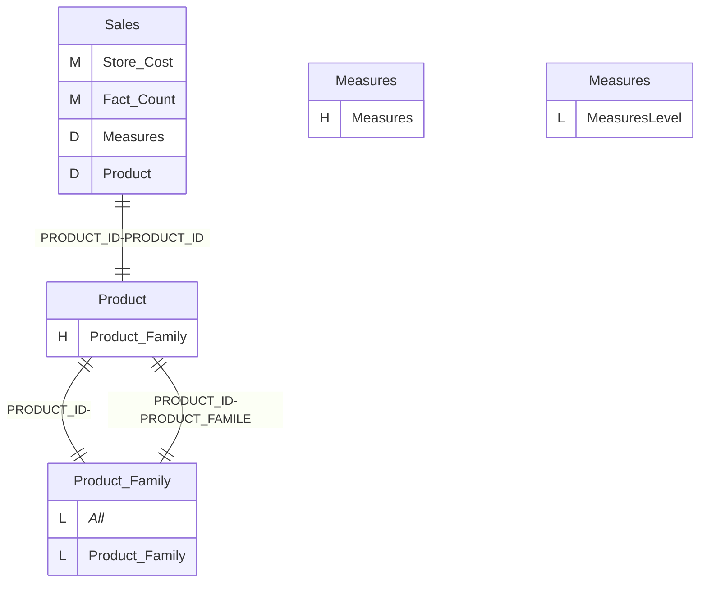
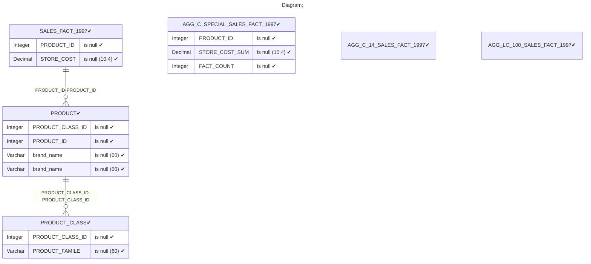
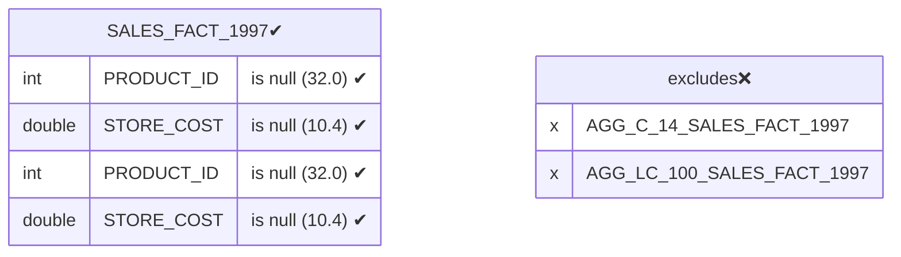
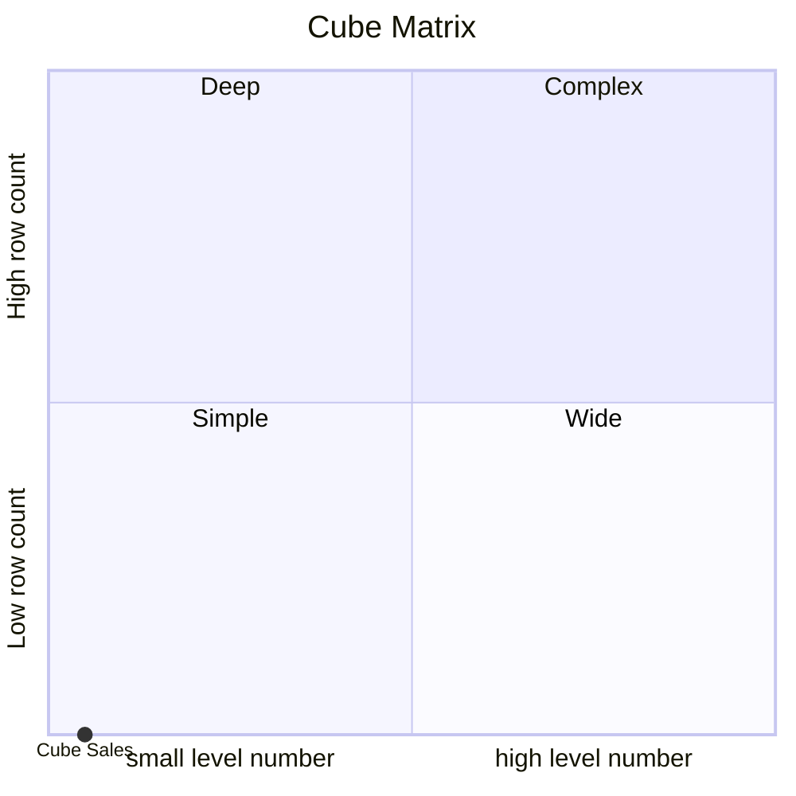

# Documentation
### CatalogName : Cube_with_Aggregate_tables
### Schema Cube_with_Aggregate_tables : 
---
### Cubes :

    Sales

### Cube "Sales" diagram:

---

---
### Database :
---

---
" Aggregation section:

---

---
### Cube Matrix for Cube_with_Aggregate_tables:

---
### Database :
---

---
## Validation result for catalog Cube_with_Aggregate_tables
## WARNING : 
|Type|   |
|----|---|
|DATABASE|Table: Schema must be set|
