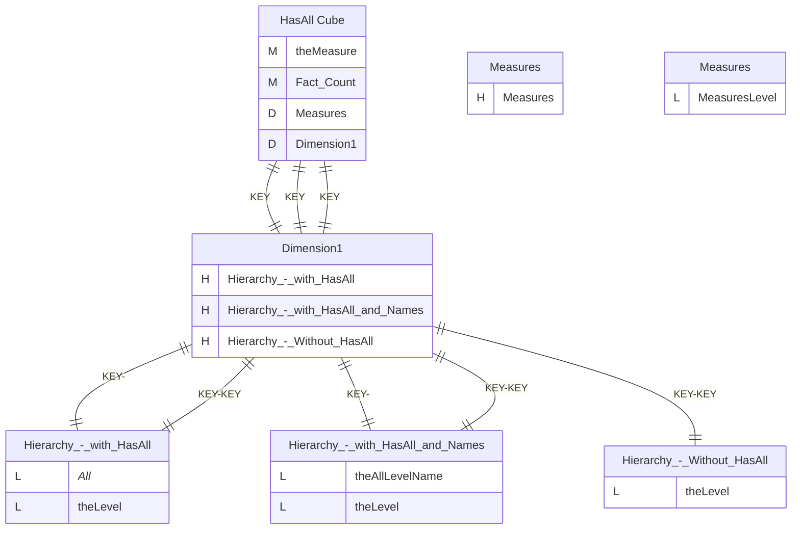
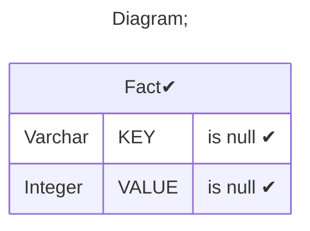
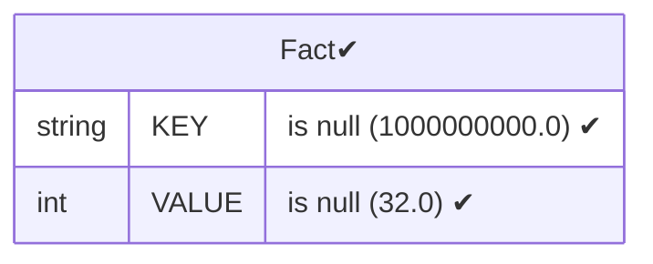
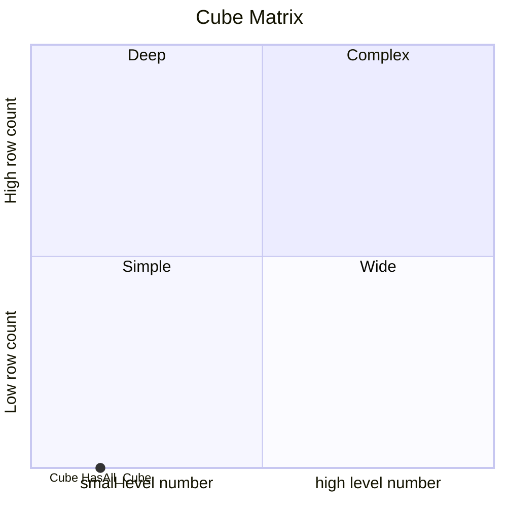

# Documentation
### CatalogName : Hierarchy - HasAll-Level
### Schema Hierarchy - HasAll-Level : 
---
### Cubes :

    HasAll Cube

### Cube "HasAll Cube" diagram:

---

---
### Database :
---

---
" Aggregation section:

---

---
### Cube Matrix for Hierarchy - HasAll-Level:

---
### Database :
---

---
## Validation result for catalog Hierarchy - HasAll-Level
## WARNING : 
|Type|   |
|----|---|
|DATABASE|Table: Schema must be set|
