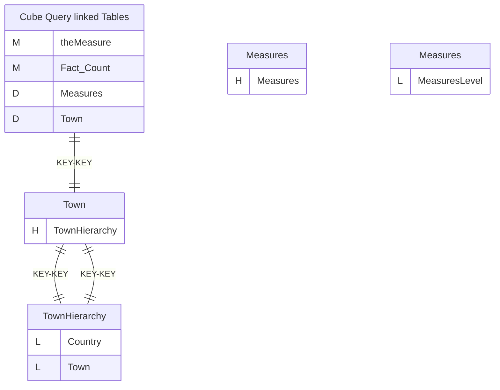
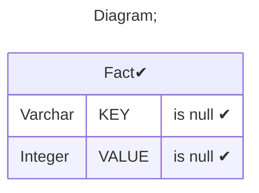
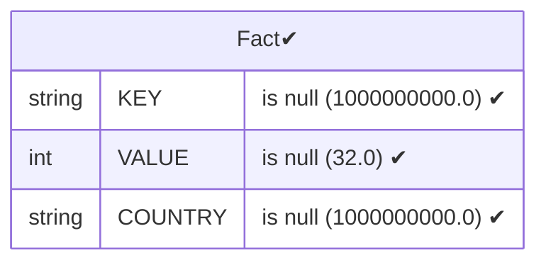
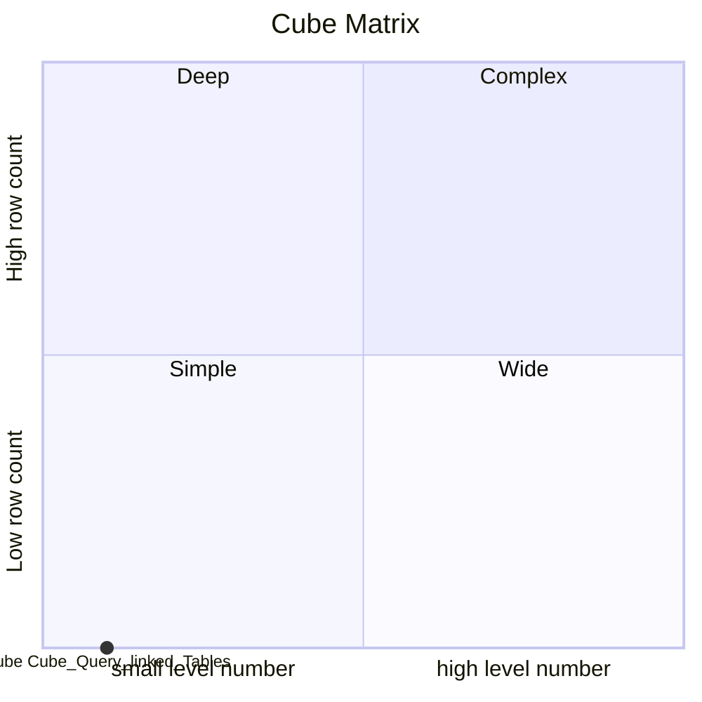

# Documentation
### CatalogName : Hierarchy - Query based on all in one Table
### Schema Hierarchy - Query based on all in one Table : 
---
### Cubes :

    Cube Query linked Tables

### Cube "Cube Query linked Tables" diagram:

---

---
### Database :
---

---
" Aggregation section:

---

---
### Cube Matrix for Hierarchy - Query based on all in one Table:

---
### Database :
---

---
## Validation result for catalog Hierarchy - Query based on all in one Table
## WARNING : 
|Type|   |
|----|---|
|DATABASE|Table: Schema must be set|
