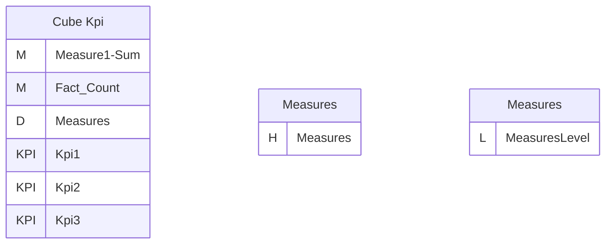
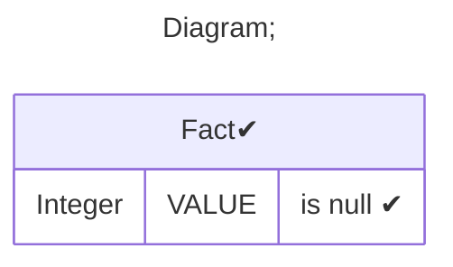
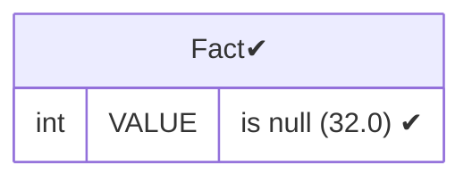
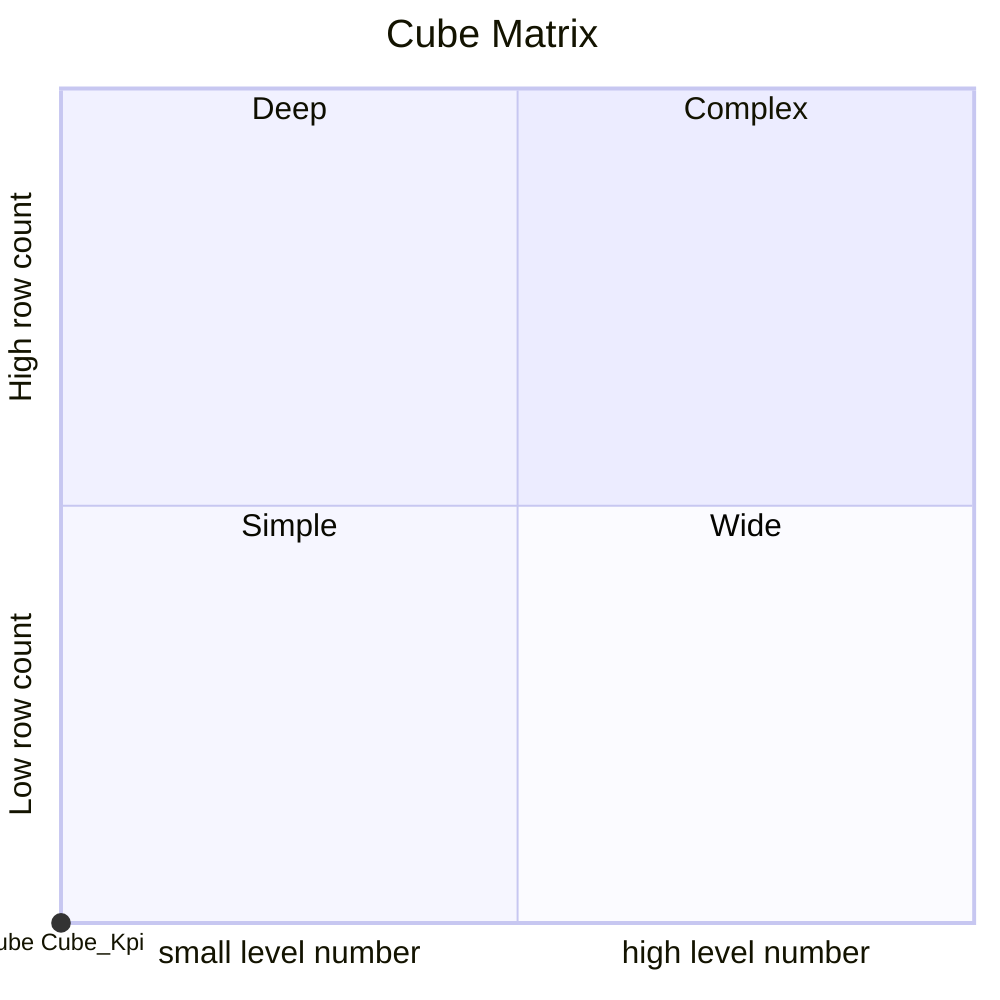

# Documentation
### CatalogName : Kpi - parent ring
### Schema Kpi - parent ring : 
---
### Cubes :

    Cube Kpi

### Cube "Cube Kpi" diagram:

---

---
### Database :
---

---
" Aggregation section:

---

---
### Cube Matrix for Kpi - parent ring:

---
### Database :
---

---
## Validation result for catalog Kpi - parent ring
## WARNING : 
|Type|   |
|----|---|
|SCHEMA|KPIs from cube with name Cube Kpi has parent ring|
|DATABASE|Table: Schema must be set|
