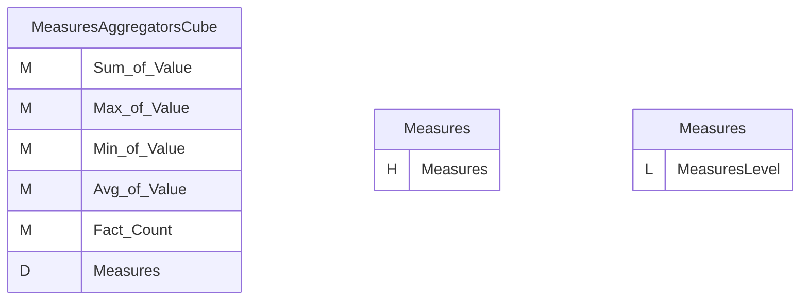
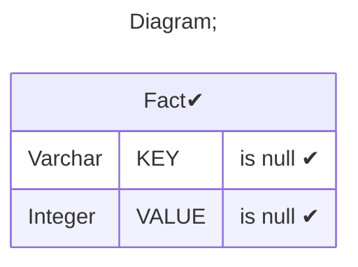
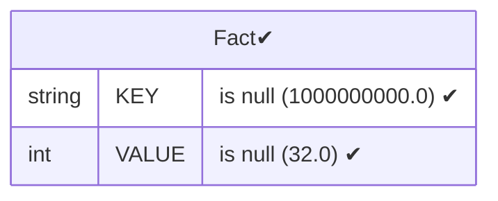
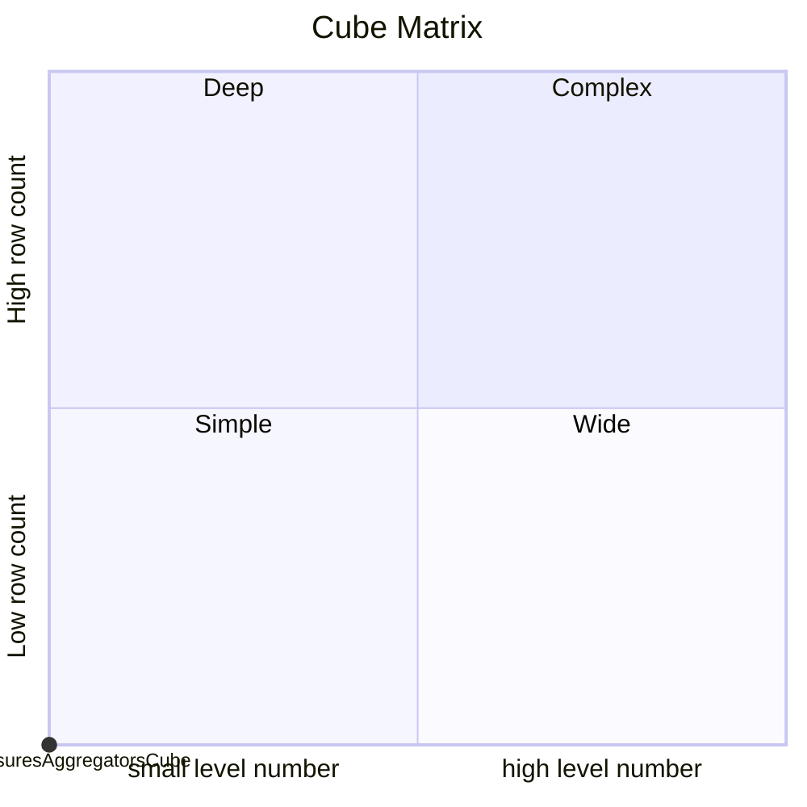

# Documentation
### CatalogName : Measure - Basic Aggregators
### Schema Measure - Basic Aggregators : 
---
### Cubes :

    MeasuresAggregatorsCube

### Cube "MeasuresAggregatorsCube" diagram:

---

---
### Database :
---

---
" Aggregation section:

---

---
### Cube Matrix for Measure - Basic Aggregators:

---
### Database :
---

---
## Validation result for catalog Measure - Basic Aggregators
## WARNING : 
|Type|   |
|----|---|
|DATABASE|Table: Schema must be set|
