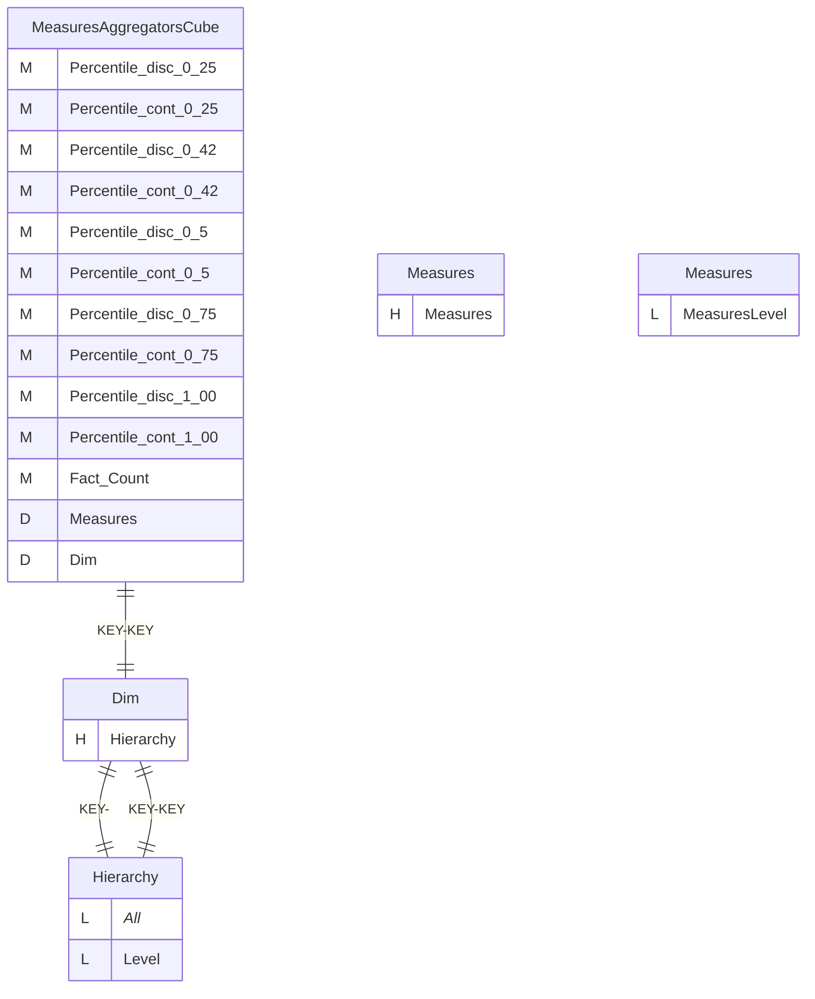
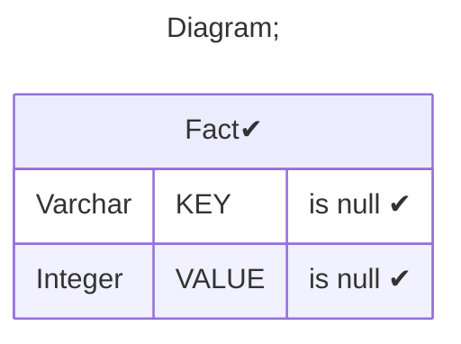
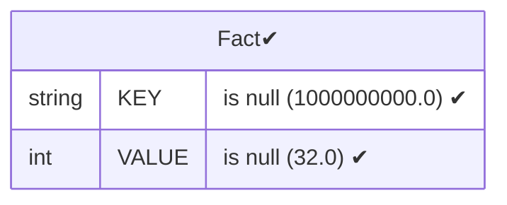
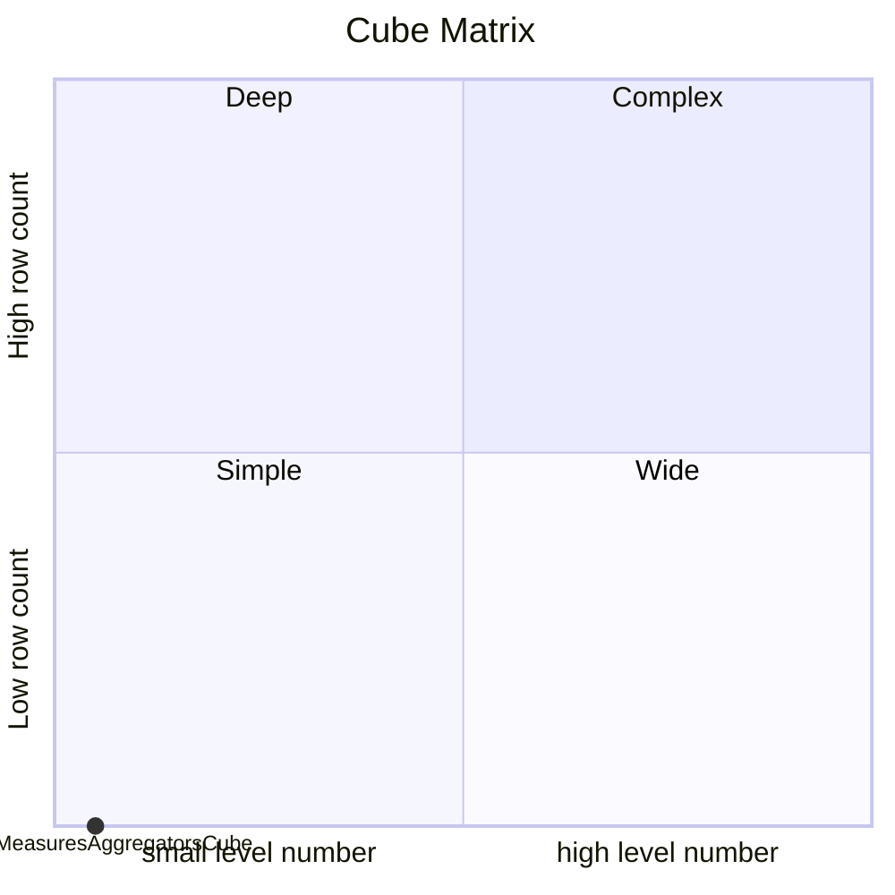

# Documentation
### CatalogName : Measure - Percentile Aggragator
### Schema Measure - Percentile Aggragator : 
---
### Cubes :

    MeasuresAggregatorsCube

### Cube "MeasuresAggregatorsCube" diagram:

---

---
### Database :
---

---
" Aggregation section:

---

---
### Cube Matrix for Measure - Percentile Aggragator:

---
### Database :
---

---
## Validation result for catalog Measure - Percentile Aggragator
## WARNING : 
|Type|   |
|----|---|
|DATABASE|Table: Schema must be set|
