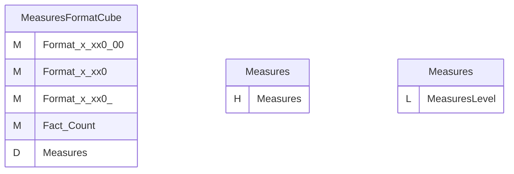
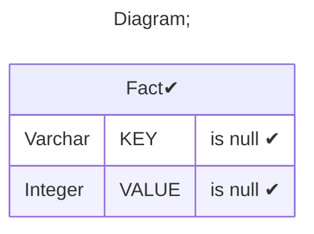
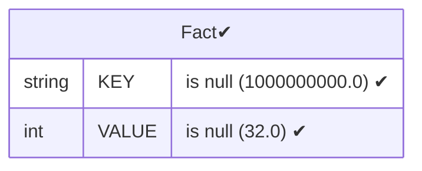
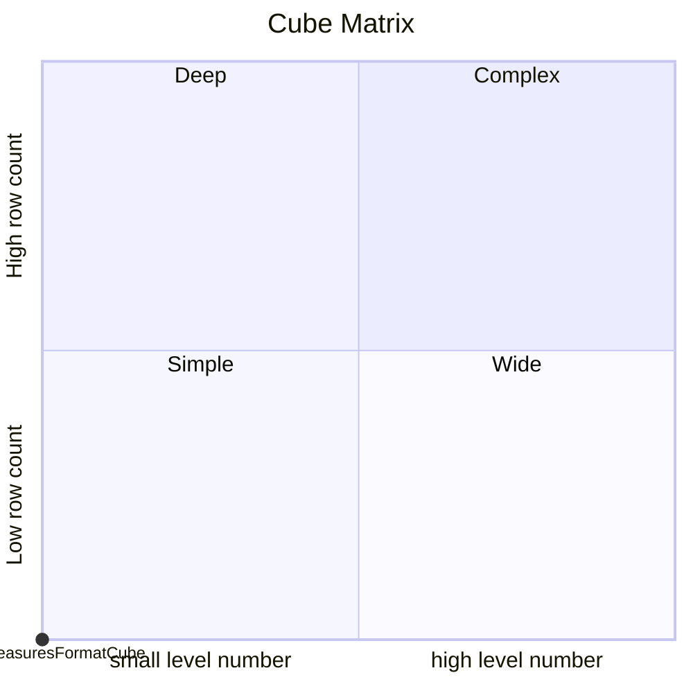

# Documentation
### CatalogName : Measure - Formats
### Schema Measure - Formats : 
---
### Cubes :

    MeasuresFormatCube

### Cube "MeasuresFormatCube" diagram:

---

---
### Database :
---

---
" Aggregation section:

---

---
### Cube Matrix for Measure - Formats:

---
### Database :
---

---
## Validation result for catalog Measure - Formats
## WARNING : 
|Type|   |
|----|---|
|DATABASE|Table: Schema must be set|
