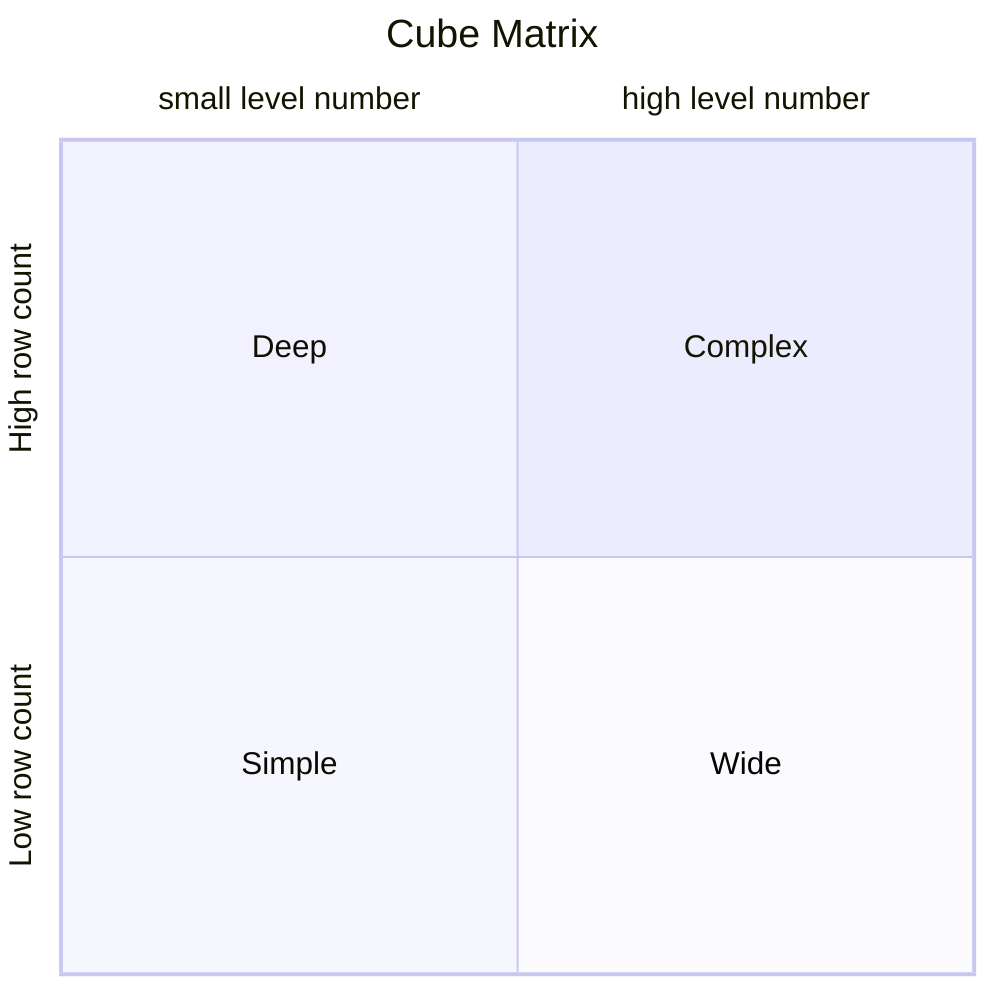
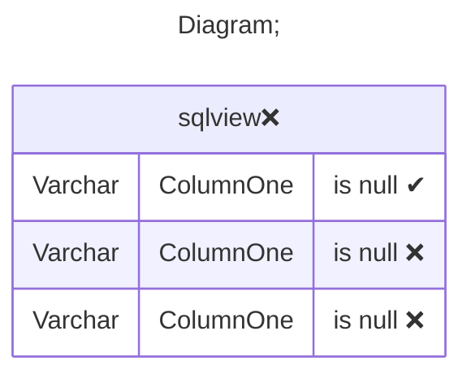

# Documentation
### CatalogName : Database - SqlView
### Schema Database - SqlView : 
---
### Cubes :

    

### Cube Matrix for Database - SqlView:

```mermaid
quadrantChart
title Cube Matrix
x-axis small level number --> high level number
y-axis Low row count --> High row count
quadrant-1 Complex
quadrant-2 Deep
quadrant-3 Simple
quadrant-4 Wide

```
---
### Database :
---

```mermaid
---
title: Diagram;
---
erDiagram
"sqlview❌"{
Varchar ColumnOne "is null ✔"
Varchar ColumnOne "is null ❌"
}
"sqlview❌"{
Varchar ColumnOne "is null ❌"
}

```
---
