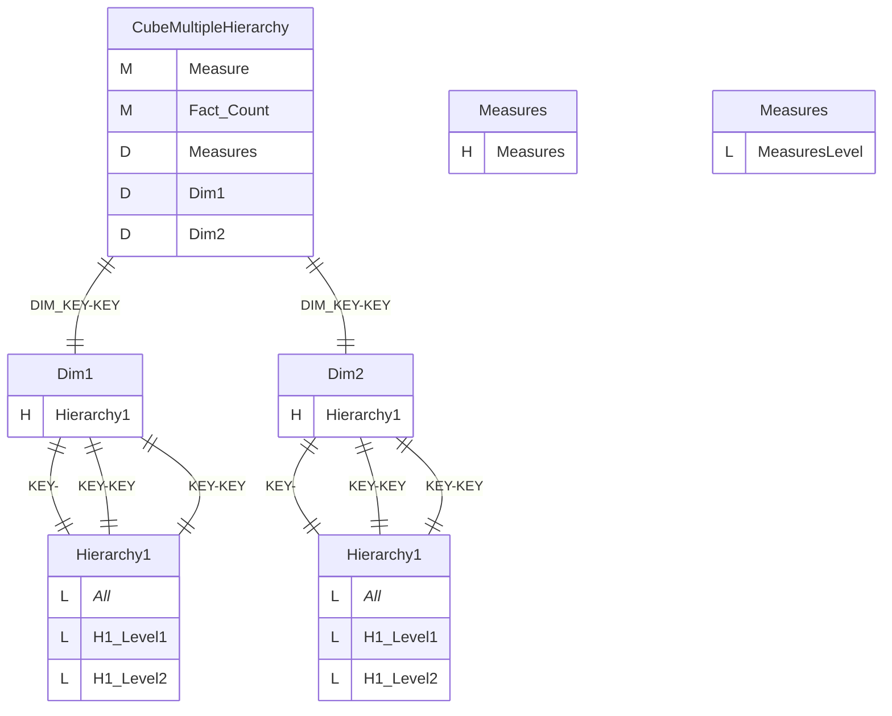
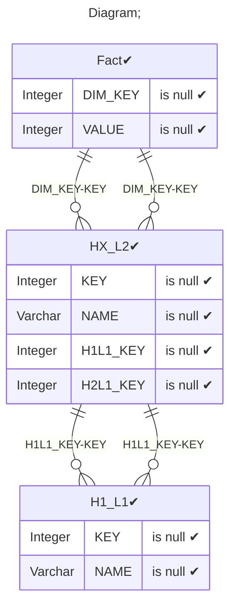
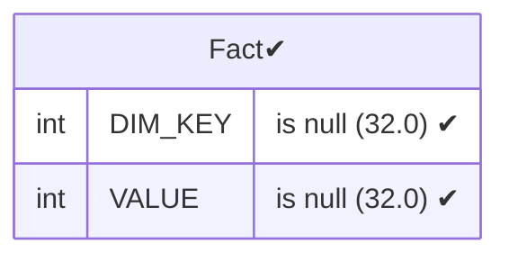
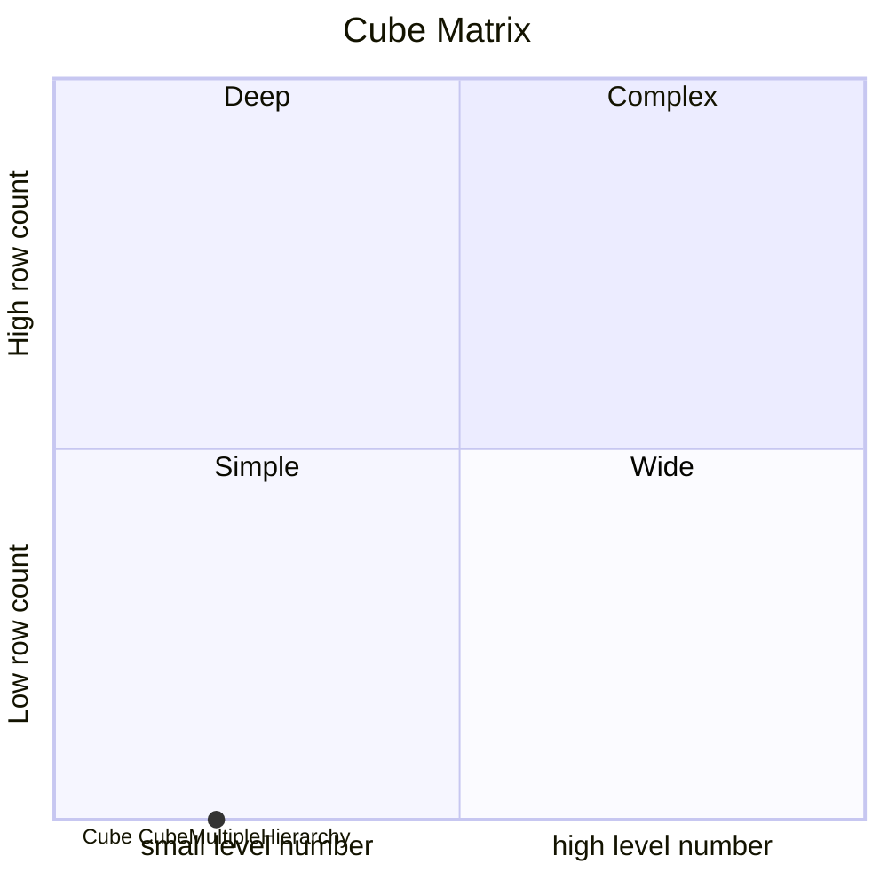

# Documentation
### CatalogName : Minimal_Cube_with_cube_dimension_level_attribute
### Schema Minimal_Cube_with_cube_dimension_level_attribute : 
---
### Cubes :

    CubeMultipleHierarchy

### Cube "CubeMultipleHierarchy" diagram:

---

---
### Database :
---

---
" Aggregation section:

---

---
### Cube Matrix for Minimal_Cube_with_cube_dimension_level_attribute:

---
### Database :
---

---
## Validation result for catalog Minimal_Cube_with_cube_dimension_level_attribute
## WARNING : 
|Type|   |
|----|---|
|DATABASE|Table: Schema must be set|
