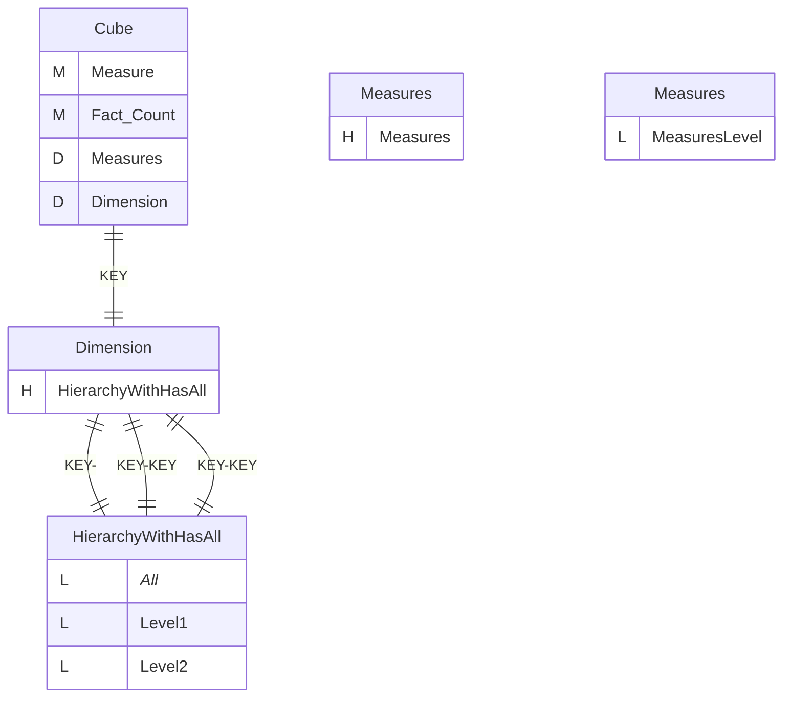
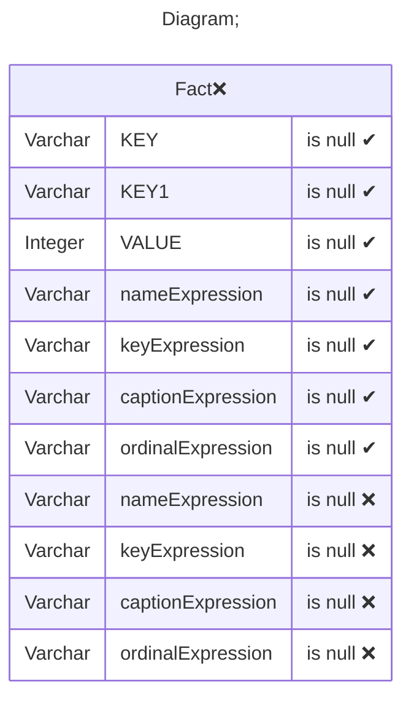
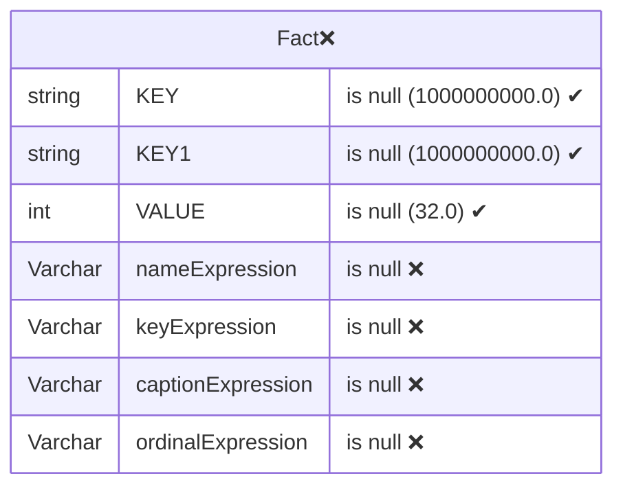
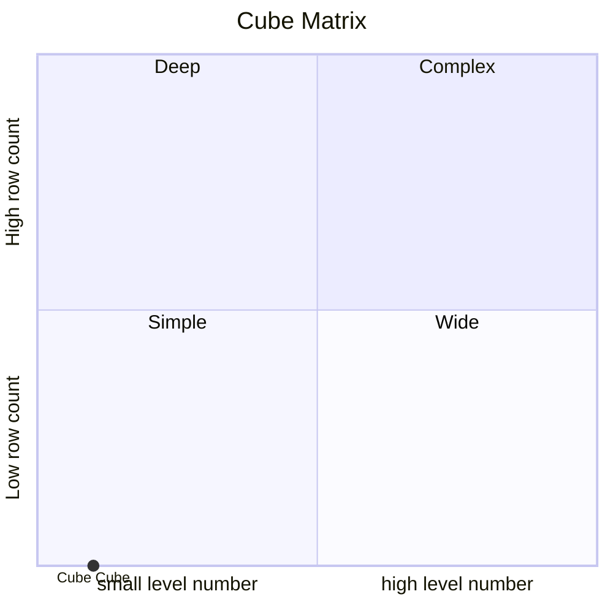

# Documentation
### CatalogName : Minimal_Cube_with_cube_dimension_level_with_expressions
### Schema Minimal_Cube_with_cube_dimension_level_with_expressions : 
---
### Cubes :

    Cube

### Cube "Cube" diagram:

---

---
### Database :
---

---
" Aggregation section:

---

---
### Cube Matrix for Minimal_Cube_with_cube_dimension_level_with_expressions:

---
### Database :
---

---
## Validation result for catalog Minimal_Cube_with_cube_dimension_level_with_expressions
## ERROR : 
|Type|   |
|----|---|
|DATABASE|Column captionExpression does not exist in table Fact|
|DATABASE|Column ordinalExpression does not exist in table Fact|
|DATABASE|Column keyExpression does not exist in table Fact|
|DATABASE|Column nameExpression does not exist in table Fact|
## WARNING : 
|Type|   |
|----|---|
|DATABASE|Table: Schema must be set|
