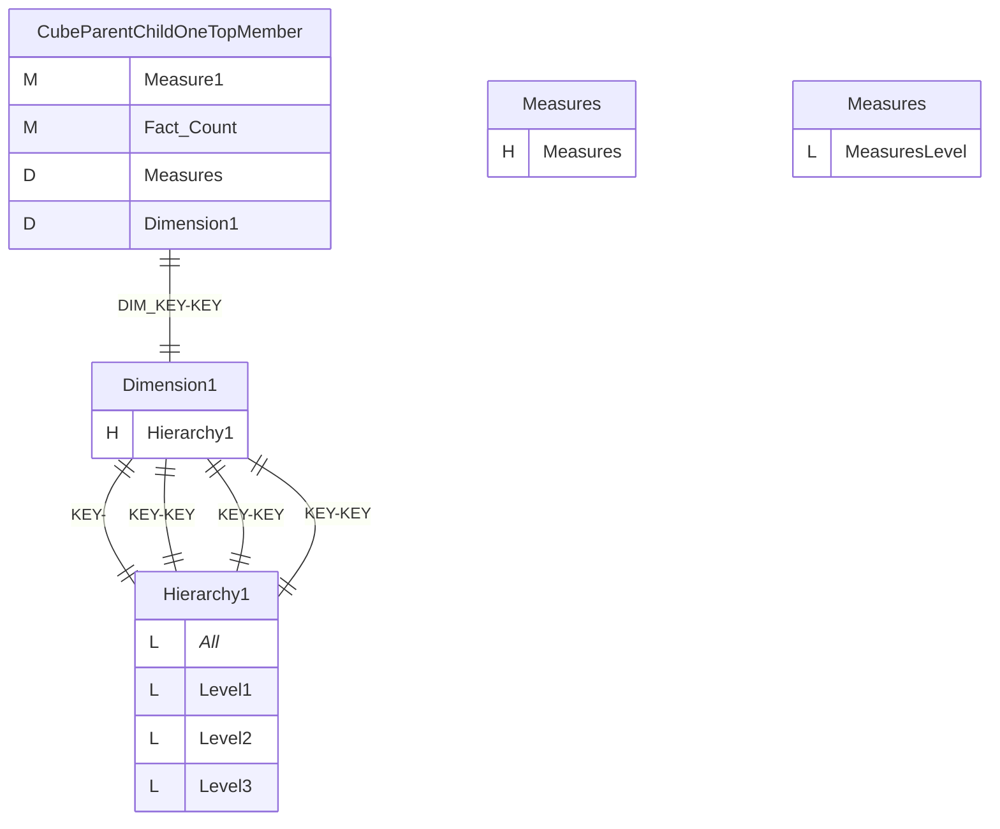
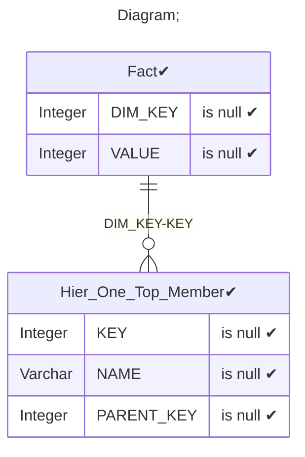
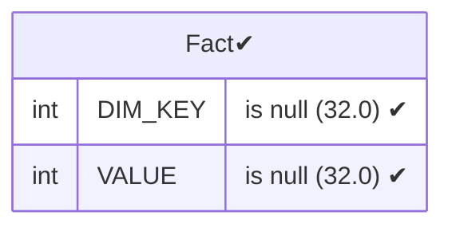
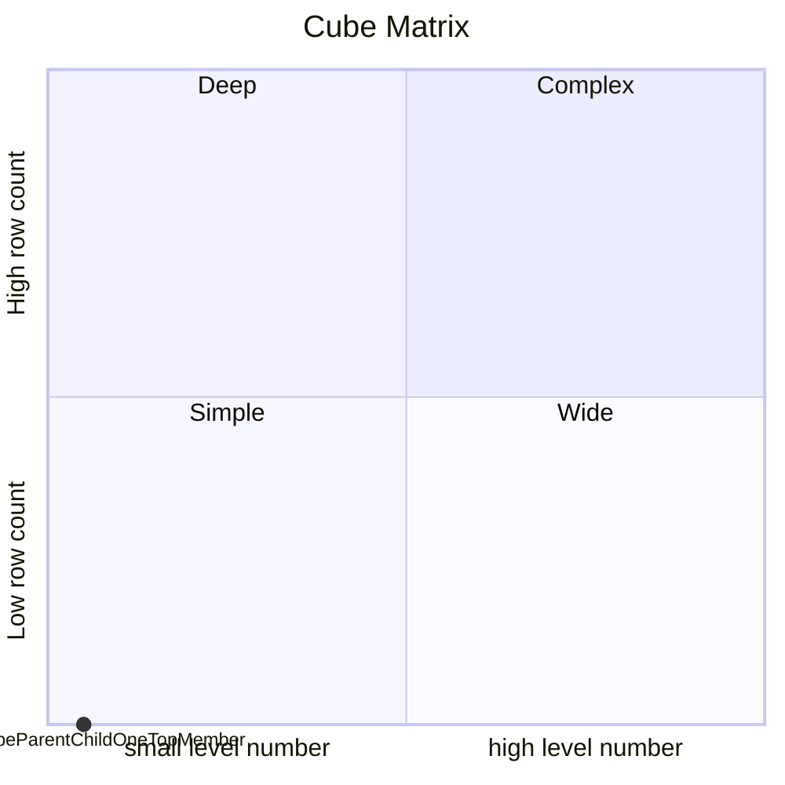

# Documentation
### CatalogName : Minimal_Parent_Child_Hierarchy
### Schema Minimal_Parent_Child_Hierarchy : 
---
### Cubes :

    CubeParentChildOneTopMember

### Cube "CubeParentChildOneTopMember" diagram:

---

---
### Database :
---

---
" Aggregation section:

---

---
### Cube Matrix for Minimal_Parent_Child_Hierarchy:

---
### Database :
---

---
## Validation result for catalog Minimal_Parent_Child_Hierarchy
## WARNING : 
|Type|   |
|----|---|
|DATABASE|Table: Schema must be set|
