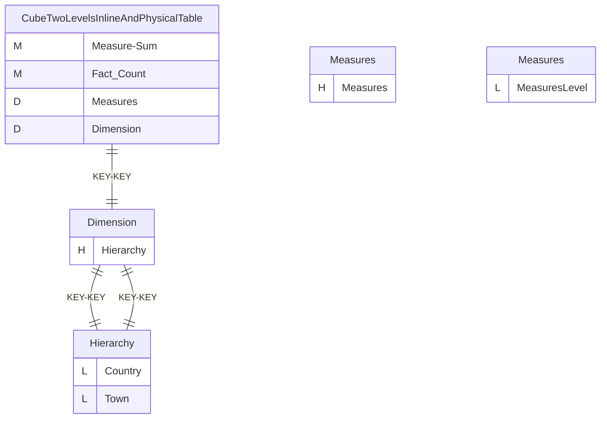
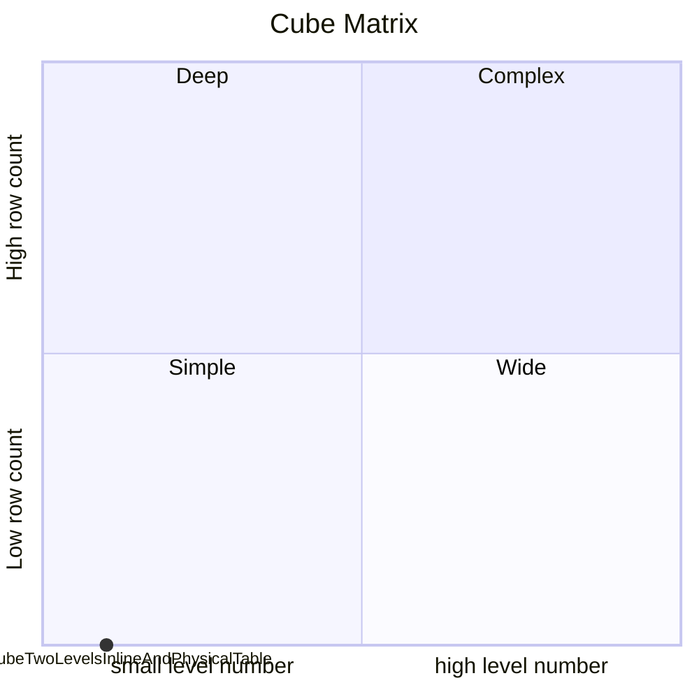
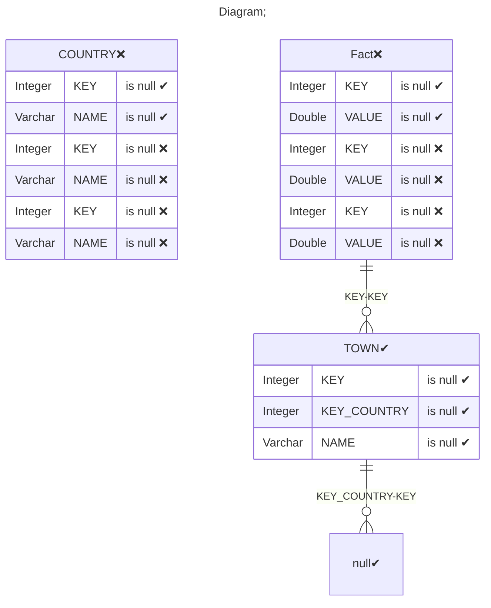

# Documentation
### CatalogName : CubeOneMeasureInlineTableLevelPhysicalAndInlineTables
### Schema CubeOneMeasureInlineTableLevelPhysicalAndInlineTables : 
---
### Cubes :

    CubeTwoLevelsInlineAndPhysicalTable

### Cube "CubeTwoLevelsInlineAndPhysicalTable" diagram:

---

---
### Cube Matrix for CubeOneMeasureInlineTableLevelPhysicalAndInlineTables:

---
### Database :
---

---
## Validation result for catalog CubeOneMeasureInlineTableLevelPhysicalAndInlineTables
## ERROR : 
|Type|   |
|----|---|
|SCHEMA|Table value does not correspond to any join|
## WARNING : 
|Type|   |
|----|---|
|DATABASE|Table: Schema must be set|
