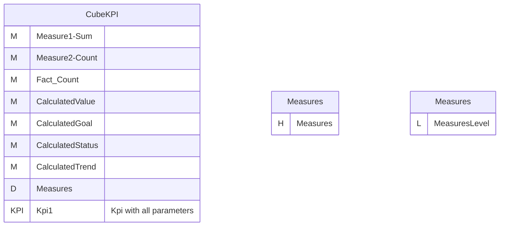
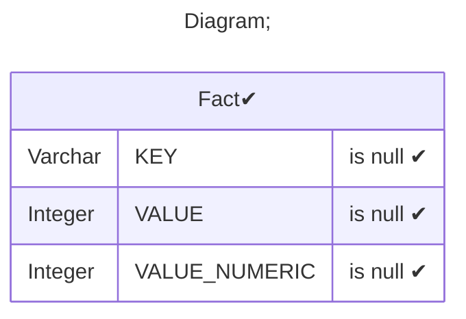
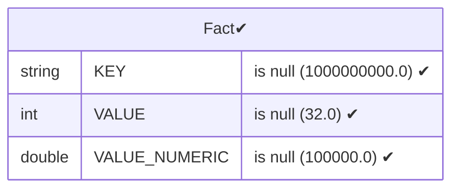
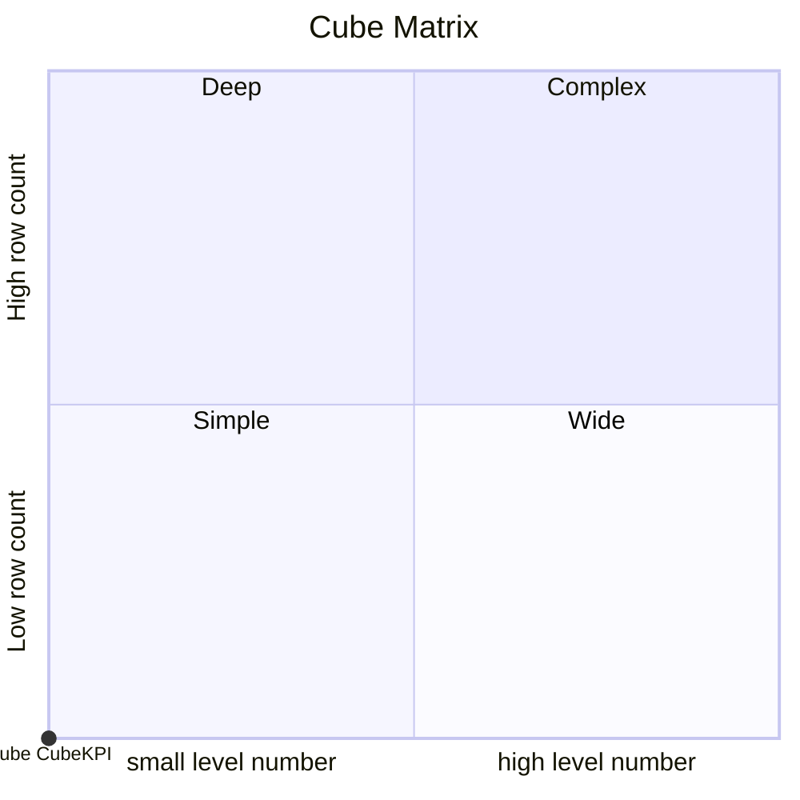

# Documentation
### CatalogName : Minimal_Cubes_With_KPI_all_Properties
### Schema Minimal_Cubes_With_KPI_all_Properties : 
---
### Cubes :

    CubeKPI

### Cube "CubeKPI" diagram:

---

---
### Database :
---

---
" Aggregation section:

---

---
### Cube Matrix for Minimal_Cubes_With_KPI_all_Properties:

---
### Database :
---

---
## Validation result for catalog Minimal_Cubes_With_KPI_all_Properties
## ERROR : 
|Type|   |
|----|---|
|SCHEMA|Hierarchy must be set for CalculatedMember with name CalculatedStatus|
|SCHEMA|Hierarchy must be set for CalculatedMember with name CalculatedGoal|
|SCHEMA|Hierarchy must be set for CalculatedMember with name CalculatedValue|
|SCHEMA|Hierarchy must be set for CalculatedMember with name CalculatedTrend|
## WARNING : 
|Type|   |
|----|---|
|DATABASE|Table: Schema must be set|
