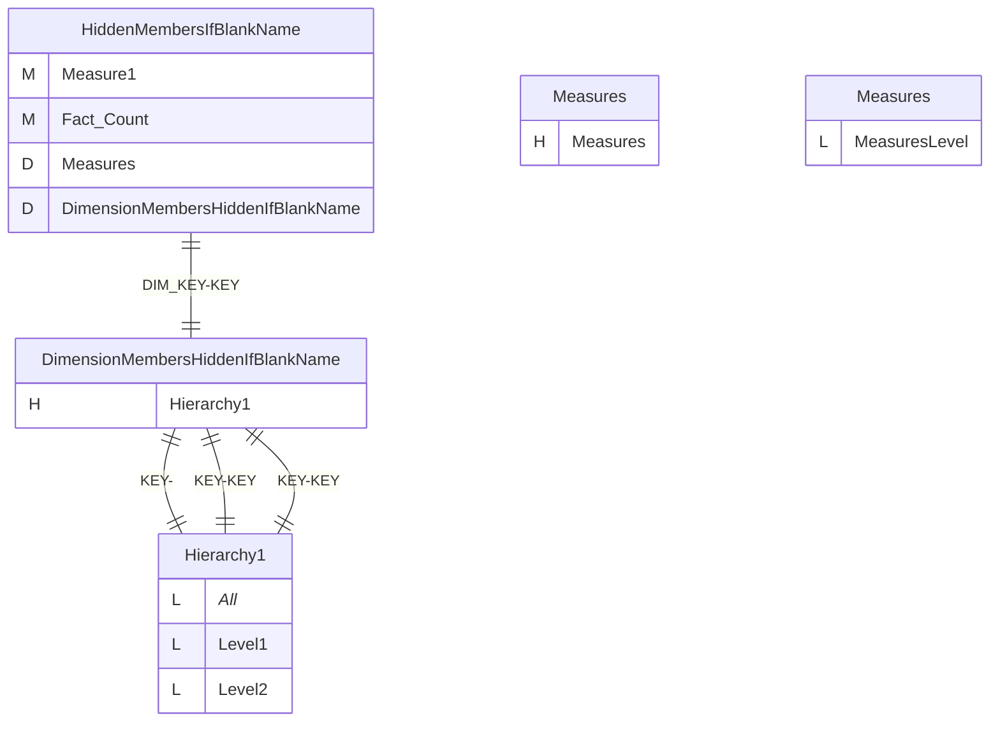
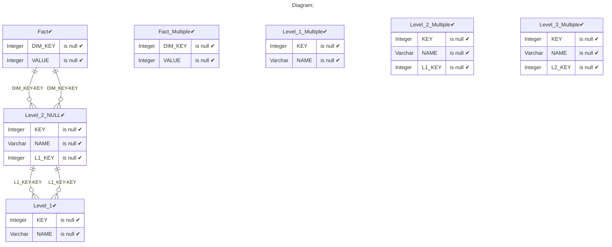
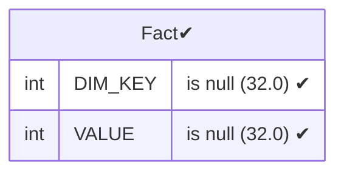
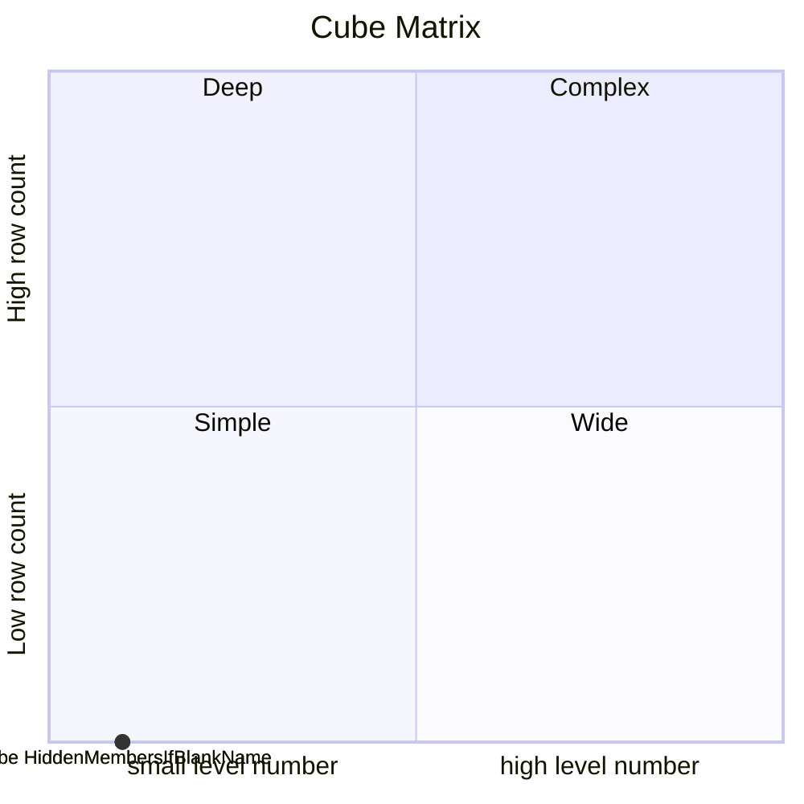

# Documentation
### CatalogName : Minimal_Single_Hierarchy_Hidden_Members_with_IfBlankName
### Schema Minimal_Single_Hierarchy_Hidden_Members_with_IfBlankName : 
---
### Cubes :

    HiddenMembersIfBlankName

### Cube "HiddenMembersIfBlankName" diagram:

---

---
### Database :
---

---
" Aggregation section:

---

---
### Cube Matrix for Minimal_Single_Hierarchy_Hidden_Members_with_IfBlankName:

---
### Database :
---

---
## Validation result for catalog Minimal_Single_Hierarchy_Hidden_Members_with_IfBlankName
## WARNING : 
|Type|   |
|----|---|
|DATABASE|Table: Schema must be set|
