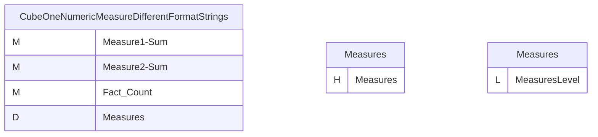
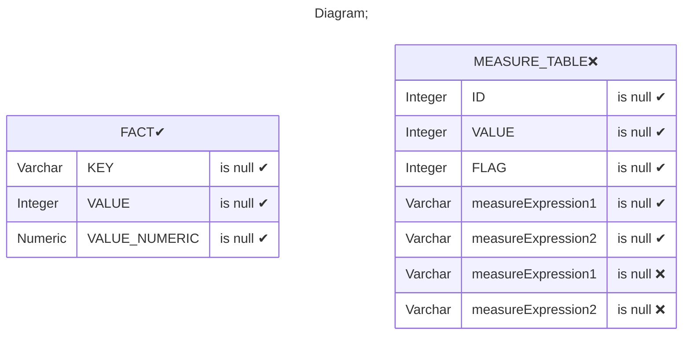
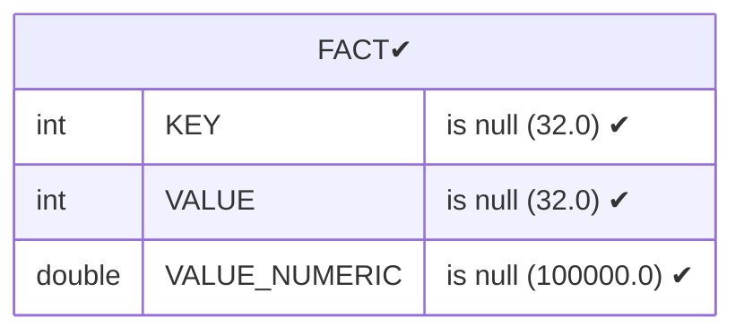
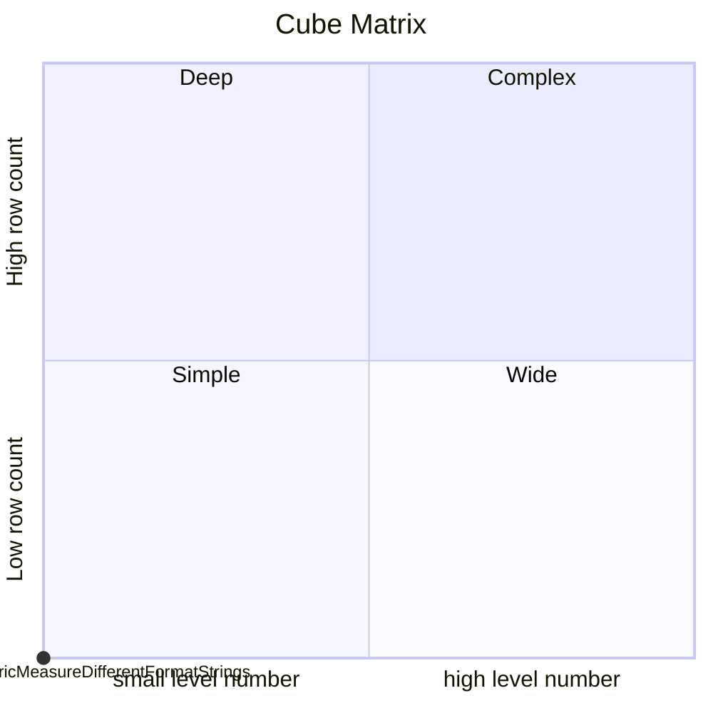

# Documentation
### CatalogName : Minimal_Cubes_With_MeasureExpression
### Schema Minimal_Cubes_With_MeasureExpression : 
---
### Cubes :

    CubeOneNumericMeasureDifferentFormatStrings

### Cube "CubeOneNumericMeasureDifferentFormatStrings" diagram:

---

---
### Database :
---

---
" Aggregation section:

---

---
### Cube Matrix for Minimal_Cubes_With_MeasureExpression:

---
### Database :
---

---
## Validation result for catalog Minimal_Cubes_With_MeasureExpression
## ERROR : 
|Type|   |
|----|---|
|DATABASE|Column measureExpression2 does not exist in table MEASURE_TABLE|
|DATABASE|Column measureExpression1 does not exist in table MEASURE_TABLE|
## WARNING : 
|Type|   |
|----|---|
|DATABASE|Table: Schema must be set|
