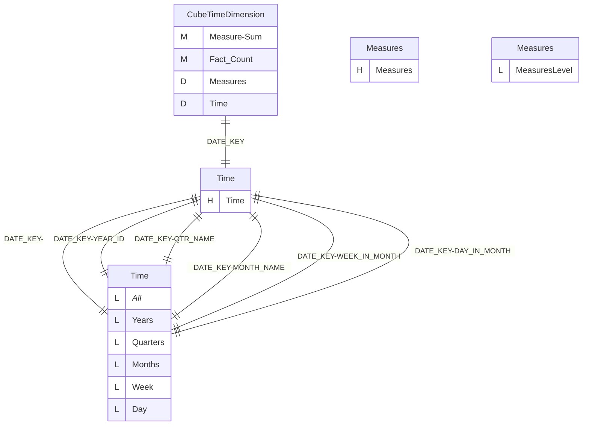
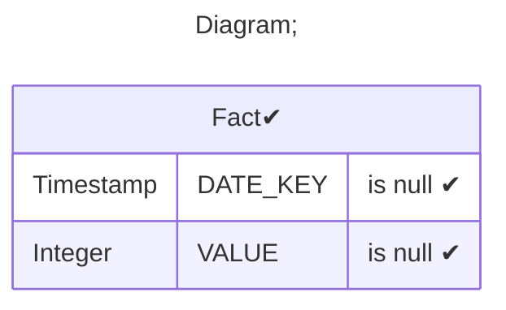
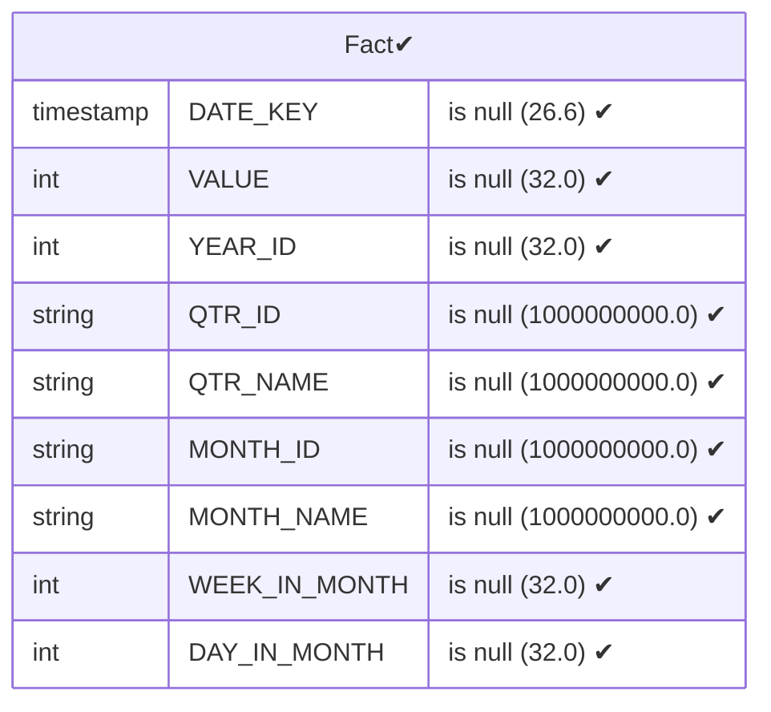
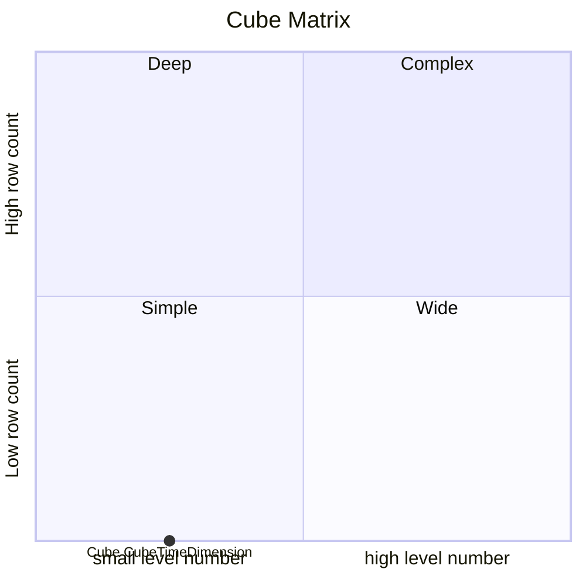

# Documentation
### CatalogName : Minimal_Cube_with_Time_Dimension
### Schema Minimal_Cube_with_Time_Dimension : 
---
### Cubes :

    CubeTimeDimension

### Cube "CubeTimeDimension" diagram:

---

---
### Database :
---

---
" Aggregation section:

---

---
### Cube Matrix for Minimal_Cube_with_Time_Dimension:

---
### Database :
---

---
## Validation result for catalog Minimal_Cube_with_Time_Dimension
## WARNING : 
|Type|   |
|----|---|
|DATABASE|Table: Schema must be set|
