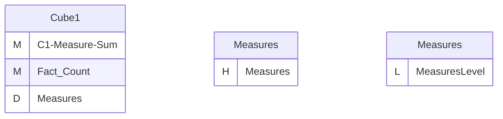
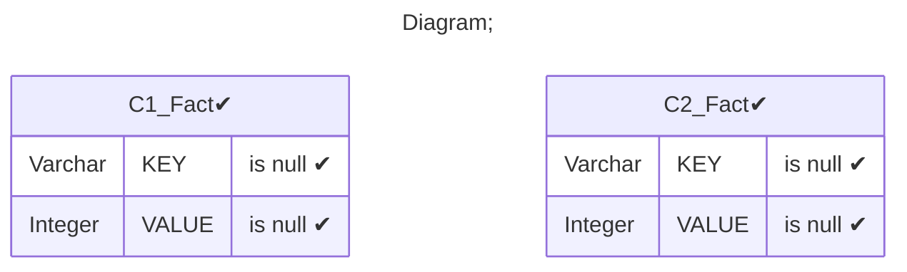
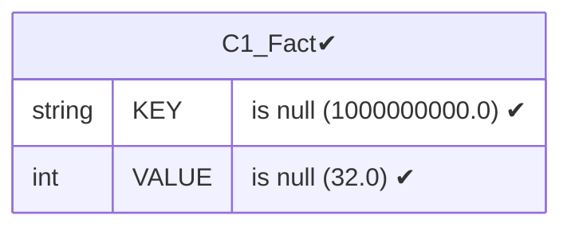
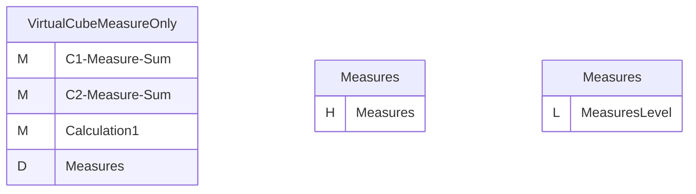
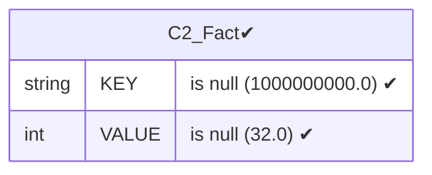
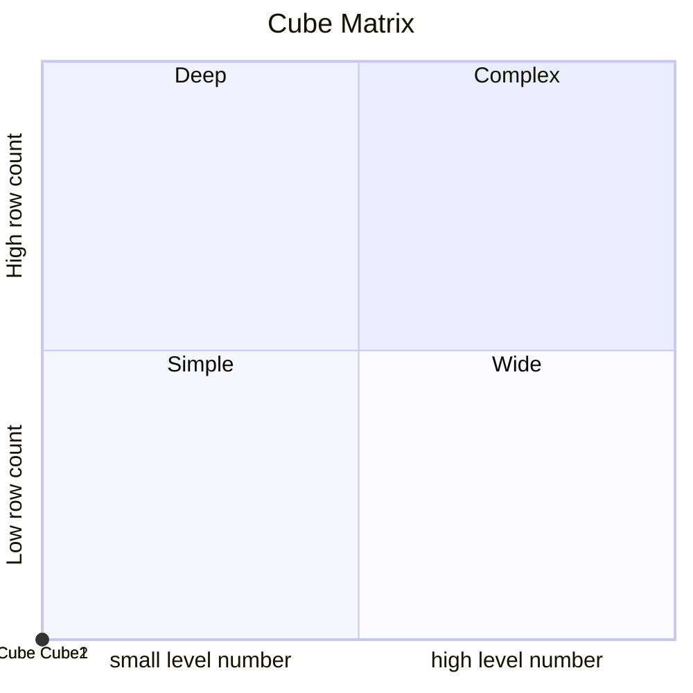

# Documentation
### CatalogName : Minimal_Virtual_Cubes_With_Measures_only
### Schema Minimal_Virtual_Cubes_With_Measures_only : 
---
### Cubes :

    Cube1, VirtualCubeMeasureOnly, Cube2

### Cube "Cube1" diagram:

---

---
### Database :
---

---
" Aggregation section:

---

---
### Cube "VirtualCubeMeasureOnly" diagram:

---

---
### Cube "Cube2" diagram:

---

---
### Database :
---

---
" Aggregation section:

---

---
### Cube Matrix for Minimal_Virtual_Cubes_With_Measures_only:

---
### Database :
---

---
## Validation result for catalog Minimal_Virtual_Cubes_With_Measures_only
## ERROR : 
|Type|   |
|----|---|
|SCHEMA|VirtualCube with name VirtualCubeMeasureOnly must contain dimensions |
|SCHEMA|Hierarchy must be set for CalculatedMember with name Calculation1|
## WARNING : 
|Type|   |
|----|---|
|DATABASE|Table: Schema must be set|
