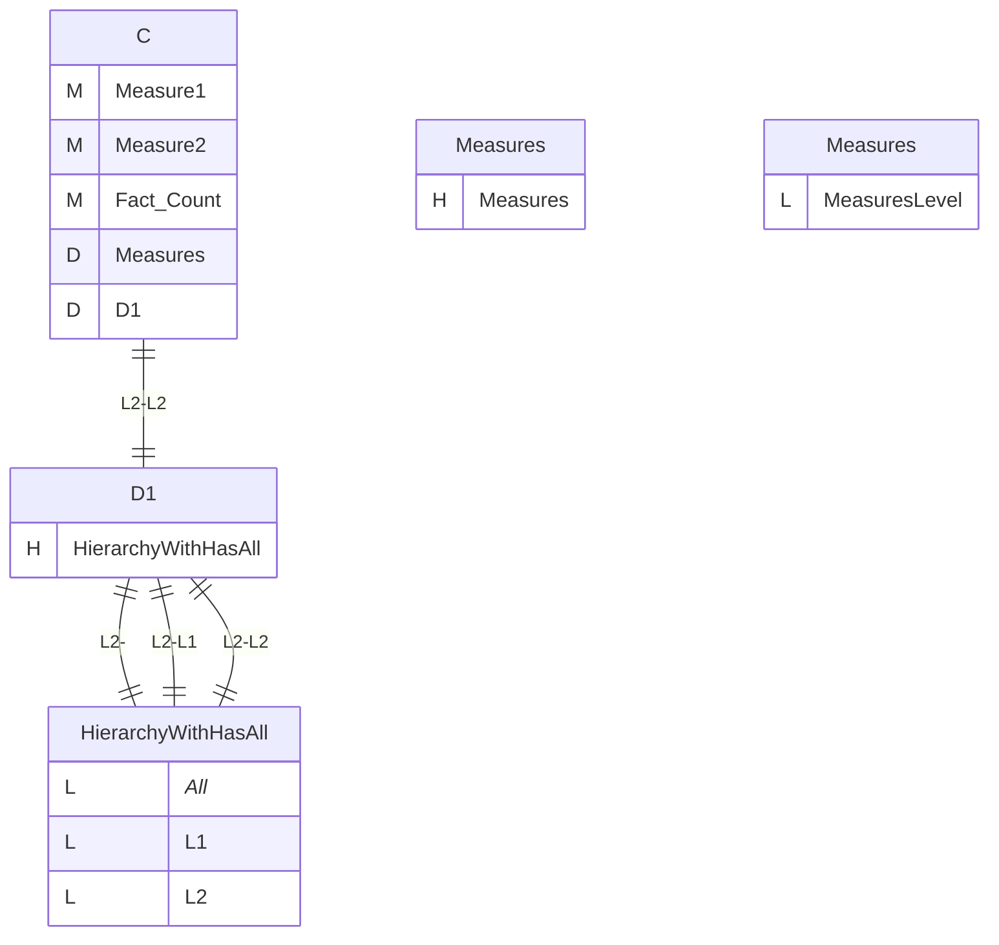
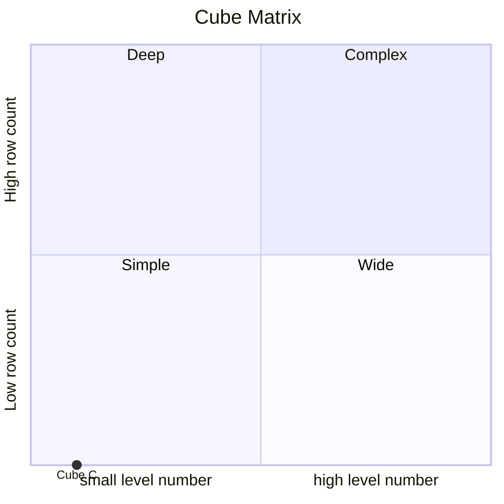
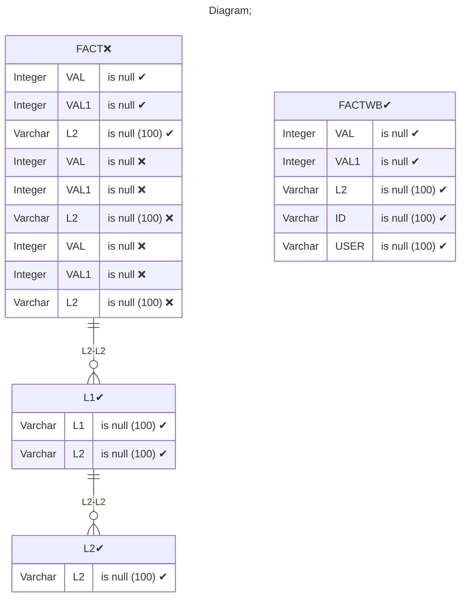

# Documentation
### CatalogName : tutorial_for_writeback_with_fact_InlineTable
### Schema tutorial_for_writeback_with_fact_InlineTable : 
---
### Cubes :

    C

### Cube "C" diagram:

---

---
### Cube Matrix for tutorial_for_writeback_with_fact_InlineTable:

---
### Database :
---

---
## Validation result for catalog tutorial_for_writeback_with_fact_InlineTable
## ERROR : 
|Type|   |
|----|---|
|SCHEMA|Dimension with name D1 absent in cube with name C for write back|
## WARNING : 
|Type|   |
|----|---|
|DATABASE|Table: Schema must be set|
