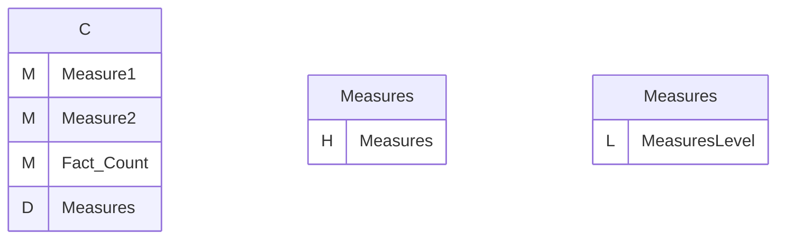
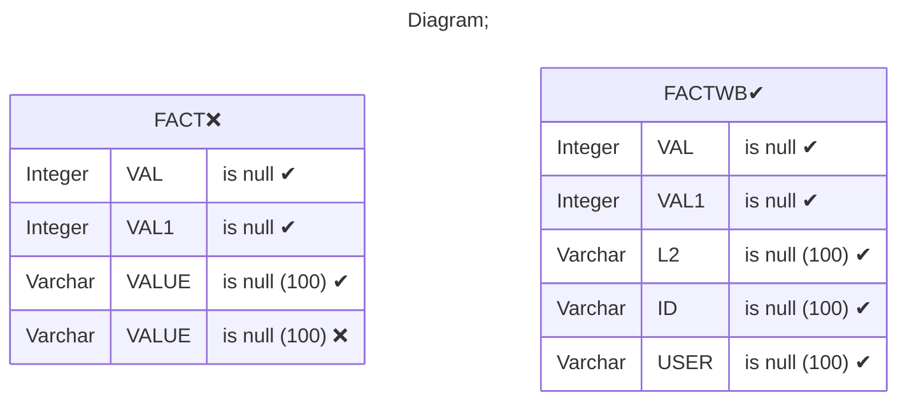
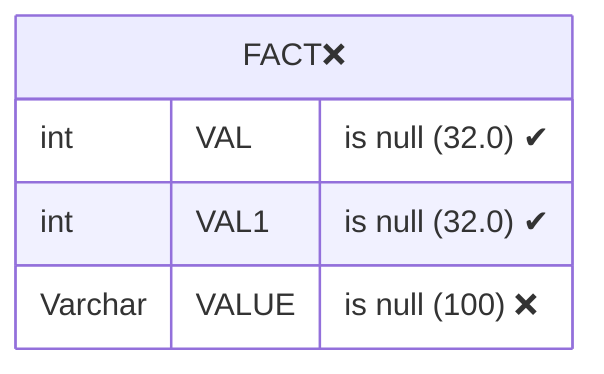
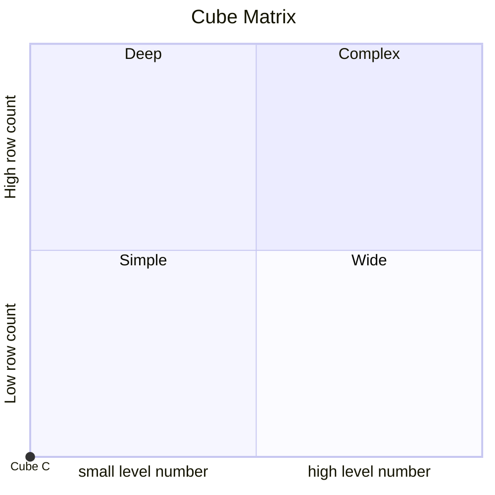

# Documentation
### CatalogName : Writeback_without_dimension
### Schema Writeback_without_dimension : 
---
### Cubes :

    C

### Cube "C" diagram:

---

---
### Database :
---

---
" Aggregation section:

---

---
### Cube Matrix for Writeback_without_dimension:

---
### Database :
---

---
## Validation result for catalog Writeback_without_dimension
## ERROR : 
|Type|   |
|----|---|
|DATABASE|Column VALUE does not exist in table FACT|
## WARNING : 
|Type|   |
|----|---|
|DATABASE|Table: Schema must be set|
